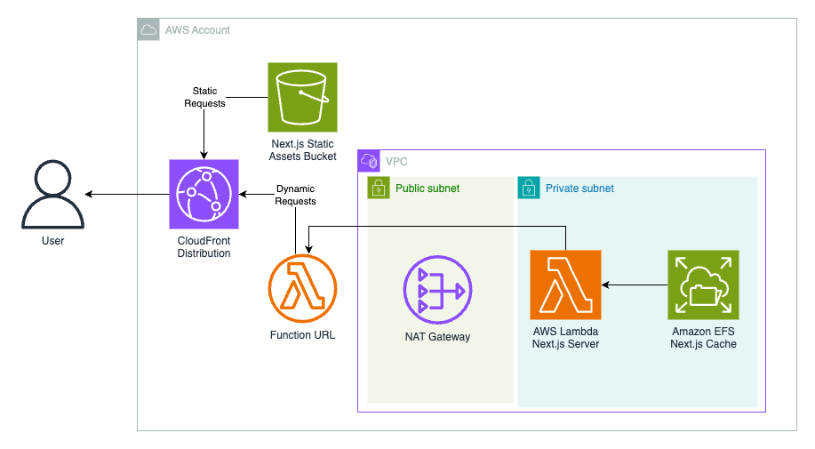
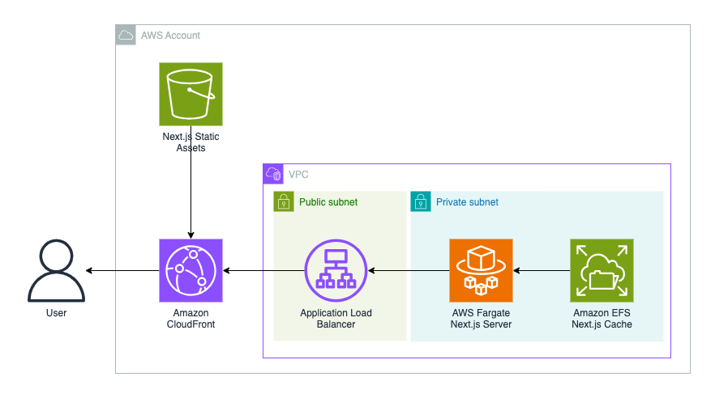
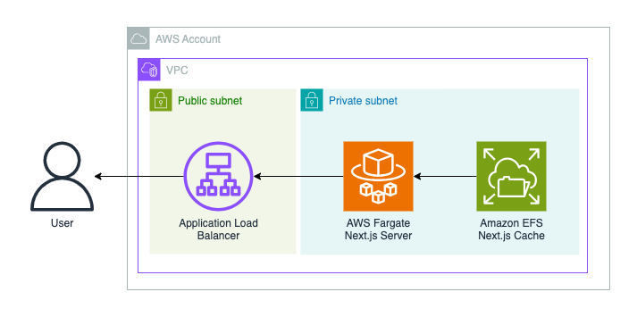
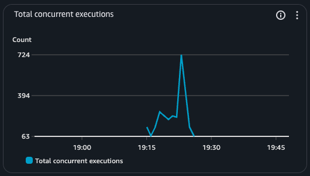

[](https://www.npmjs.org/package/cdk-nextjs)


# CDK Next.js Construct Library

<!--BEGIN STABILITY BANNER-->

---


> The APIs of higher level constructs in this module are experimental and under active development.
> They are subject to non-backward compatible changes or removal in any future version. These are
> not subject to the [Semantic Versioning](https://semver.org/) model and breaking changes will be
> announced in the release notes. This means that while you may use them, you may need to update
> your source code when upgrading to a newer version of this package.

---

<!--END STABILITY BANNER-->

Deploy [Next.js](https://nextjs.org/) apps on [AWS](https://aws.amazon.com/) with the [AWS CDK](https://aws.amazon.com/cdk/).

## Features

- Supports all features of Next.js App and Pages Router for [Node.js Runtime](https://nextjs.org/docs/app/building-your-application/rendering/edge-and-nodejs-runtimes#nodejs-runtime). One exception is `NextjsGlobalFunctions` does not currently support [ISR](https://nextjs.org/docs/app/guides/incremental-static-regeneration) - waiting for [Official Next.js Deployment Adapters API](https://github.com/vercel/next.js/discussions/77740).
- Choose your AWS architecture for Next.js with the supported constructs: `NextjsGlobalFunctions`, `NextjsGlobalContainers`, `NextjsRegionalContainers`.
- Global Content Delivery Network (CDN) built with [Amazon CloudFront](https://aws.amazon.com/cloudfront/) to deliver content with low latency and high transfer speeds.
- Serverless functions powered by [AWS Lambda](https://aws.amazon.com/lambda/) or serverless containers powered by [AWS Fargate](https://aws.amazon.com/fargate/).
- Static assets (JS, CSS, public folder) are stored and served from [Amazon Simple Storage Service (S3)](https://aws.amazon.com/s3/) for global constructs to decrease latency and reduce compute costs.
- [Optimized images](https://nextjs.org/docs/pages/building-your-application/optimizing/images), [data cache](https://nextjs.org/docs/app/building-your-application/caching#data-cache), and [full route cache](https://nextjs.org/docs/app/building-your-application/caching#full-route-cache) are shared across compute with [Amazon Elastic File System (EFS)](https://aws.amazon.com/efs/).
- Customize every construct via `overrides`.
- AWS security and operational best practices are utilized, guided by [cdk-nag](https://github.com/cdklabs/cdk-nag).
- First class support for [monorepos](https://monorepo.tools/).
- [AWS GovCloud (US)](https://aws.amazon.com/govcloud-us) compatible (with `NextjsRegionalContainers`).

## Getting Started

1. If you don’t have a Next.js project yet, follow [these steps](https://nextjs.org/docs/getting-started) to create one.
1. Install [Docker](https://www.docker.com/). We recommend [Rancher Desktop](https://rancherdesktop.io/) with dockerd (moby) container engine enabled.
1. Install [Node.js](https://nodejs.org/en). We recommend the long term support (LTS) version.
1. Set your [next.config.js](https://nextjs.org/docs/pages/api-reference/next-config-js) [output](https://nextjs.org/docs/pages/api-reference/next-config-js/output) key to `"standalone"`. Learn more here about [Standalone Output](https://nextjs.org/docs/pages/api-reference/next-config-js/output#automatically-copying-traced-files).
1. Setup [AWS Cloud Development Kit](https://docs.aws.amazon.com/cdk/v2/guide/home.html) app.
1. Install the construct package: `npm install cdk-nextjs`
1. `cdk deploy`
1. Visit URL printed in terminal (CloudFormation Output) to view your Next.js app!

## Basic Example CDK App

```ts
import { App, Stack, StackProps } from "aws-cdk-lib";
import { Construct } from "constructs";
import { NextjsGlobalFunctions } from "cdk-nextjs";
import { join } from "node:path";

class NextjsStack extends Stack {
  constructor(scope: Construct, id: string, props?: StackProps) {
    super(scope, id, props);
    new NextjsGlobalFunctions(this, "Nextjs", {
      healthCheckPath: "/api/health",
      buildContext: join(import.meta.dirname, ".."),
    });
  }
}

const app = new App();

new NextjsStack(app, "nextjs");
```

See [examples/](./examples/) for more usage examples.

## Architecture

### `NextjsGlobalFunctions`

Architecture includes [AWS Lambda](https://docs.aws.amazon.com/lambda/latest/dg/welcome.html) Functions to respond to dynamic requests and [CloudFront](https://docs.aws.amazon.com/AmazonCloudFront/latest/DeveloperGuide/Introduction.html) Distribution to globally serve requests and distribute static assets. Use this construct when you have unpredictable traffic, can afford occasional latency (i.e. cold starts - [typically 1% of production traffic](https://aws.amazon.com/blogs/compute/operating-lambda-performance-optimization-part-1/)), and/or want the most granular pricing model. ([code](./src/root-constructs/nextjs-global-functions.ts#L81))



### `NextjsGlobalContainers`

Architecture includes [ECS Fargate](https://docs.aws.amazon.com/AmazonECS/latest/developerguide/AWS_Fargate.html) containers to respond to dynamic requests and [CloudFront](https://docs.aws.amazon.com/AmazonCloudFront/latest/DeveloperGuide/Introduction.html) Distribution to globally serve requests and distribute static assets. Use this option when you have predictable traffic, need the lowest latency, and/or can afford a less granular pricing model. ([code](./src/root-constructs/nextjs-global-containers.ts#L76))



### `NextjsRegionalContainers`

Architecture includes [ECS Fargate](https://docs.aws.amazon.com/AmazonECS/latest/developerguide/AWS_Fargate.html) containers to respond to dynamic requests and [Application Load Balancer](https://aws.amazon.com/elasticloadbalancing/application-load-balancer/) to regionally serve requests. Use this options when you cannot use Amazon CloudFront (i.e. [AWS GovCloud](https://aws.amazon.com/govcloud-us/?whats-new.sort-by=item.additionalFields.postDateTime&whats-new.sort-order=desc)). ([code](./src/root-constructs/nextjs-regional-containers.ts#L41))



## Why

The simplest path to deploy Next.js is on [Vercel](https://vercel.com/) - the Platform-as-a-Service company behind Next.js. However, deploying to Vercel can be expensive and some developers want all of their workloads running _directly_ on AWS. Developers can deploy Next.js on AWS through [AWS Amplify Hosting](https://docs.aws.amazon.com/amplify/latest/userguide/ssr-Amplifysupport.html), but Amplify does not support all Next.js features and manages AWS resources for you so they cannot be customized. If Amplify meets your requirements we recommend you use it, but if you want to use all Next.js features or want more visibility into the AWS resources then this construct is for you.

## Design Principles

- Treat Next.js as black box. Minimize reliance on Next.js internal APIs to reduce chance of incompatibility between this construct and future versions of Next.js.
- Security first.
- One architecture does not fit all.
- Enable customization everywhere.

## Limitations

- If using `NextjsRegionalFunctions` without a custom domain, API Gateway REST APIs require a [stage name](https://docs.aws.amazon.com/apigateway/latest/developerguide/set-up-stages.html) (default: `/prod`) to be specified. This causes links to pages and static assets to break because they're not prefixed with the stage name. You can work around this issue by specifying [basePath](https://nextjs.org/docs/app/api-reference/config/next-config-js/basePath) in next.config.js as your stage name. Additionally, you'll need to add middleware logic to rewrite requests to include the stage name because API Gateway does not include the stage name in the path passed to Lambda. See [examples/app-playground/middleware.ts](./examples/app-playground/middleware.ts).
- If using `NextjsGlobalFunctions` or `NextjsGlobalContainers` (which use CloudFront), the number of top level files/directories cannot exceed 25, the max number of behaviors a CloudFront Distrubtion supports. We recommend you put all of your public assets into one top level directory (i.e. public/static) so you don't reach this limit. See [CloudFront Quotas](https://docs.aws.amazon.com/AmazonCloudFront/latest/DeveloperGuide/cloudfront-limits.html) for more information.
- If using `NextjsGlobalFunctions`, when [revalidating data in Next.js](https://nextjs.org/docs/app/building-your-application/data-fetching/fetching-caching-and-revalidating#on-demand-revalidation) (i.e. [revalidatePath](https://nextjs.org/docs/app/api-reference/functions/revalidatePath)), the CloudFront Cache will still hold stale data. You'll need to use AWS SDK JS V3 [CreateInvalidationCommand](https://docs.aws.amazon.com/AWSJavaScriptSDK/v3/latest/Package/-aws-sdk-client-cloudfront/Class/CreateInvalidationCommand/) to manually invalidate the path in CloudFront. See more [here](https://docs.aws.amazon.com/AmazonCloudFront/latest/DeveloperGuide/Invalidation.html).
- If using `NextjsGlobalFunctions`, setting an Authorization header won't work by default because of Lambda Function URL with IAM Auth is already using the Authorization header. You can use the `AWS_LWA_AUTHORIZATION_SOURCE` environment variable of [AWS Lambda Web Adapter](https://github.com/awslabs/aws-lambda-web-adapter) to set an alternative Authorization header in the client which will then be set to the Authorization header when it reaches your app.

## Additional Security Recommendations

This construct by default implements all AWS security best practices that a CDK construct library reasonably can considering cost and complexity. Below are additional security practices we recommend you implement within your CDK app. Please see them below:

- [VPC Flow Logs](https://docs.aws.amazon.com/vpc/latest/userguide/flow-logs.html). See [examples/](./examples) for sample implementation.
- [Scan ECR Images For Vulnerabilities](https://docs.aws.amazon.com/AmazonECR/latest/userguide/image-scanning.html).
- For `NextjsGlobalFunctions` and `NextjsGlobalContainers`, [CloudFront Access Logs](https://docs.aws.amazon.com/AmazonCloudFront/latest/DeveloperGuide/AccessLogs.html). See [examples/](./examples) for sample implementation.
- For `NextjsGlobalContainers` and `NextjsRegionalContainers`, [ALB HTTPS Listener](https://docs.aws.amazon.com/elasticloadbalancing/latest/application/create-https-listener.html)
- If using `NextjsGlobalContainers`, enable `ReadonlyRootFilesystem`. This will remove ability to use Static On-Demand feature of Next.js so it's not enabled by default, but is recommended for security.

## Estimated Costs

### Assumptions

The following basic assumptions were used for a typical medium Next.js app. See [docs/usage.xlsx](./docs/usage.xlsx) for detailed assumptions and usage per construct type that you can plug into AWS Pricing Calculator.

| Metric                                                       | Value |
| ------------------------------------------------------------ | ----- |
| Monthly Active Users                                         | 1K    |
| Pages Visited Per Month Per User                             | 100   |
| Avg Request Size                                             | 50KB  |
| Static Requests Per Page (js, css, etc)                      | 15    |
| Static Requests Cache Hit %                                  | 50%   |
| Static Assets Size                                           | 10GB  |
| Dynamic Requests Per Page (document, optimized images, etc.) | 5     |
| Dynamic Cache Read %                                         | 50%   |
| Dynamic Cache Write %                                        | 5%    |
| Dynamic Cache Data Size                                      | 10GB  |
| Average Dynamic Cache Request Size                           | 100KB |

More Details:

- Assume ARM architecture for compute
- AWS Region: us-east-1
- Excludes charges related to: CloudWatch Logs, NAT Gateway data processing

#### NAT Gateway and Alternatives

[NAT Gateways](https://docs.aws.amazon.com/vpc/latest/userguide/vpc-nat-gateway.html) enable compute within private subnets to access the internet without directly exposing that compute to the internet. NAT Gateways prevent you from having to manage your own NAT Instances however they cost $0.045/hr/AZ resulting in charge of $64.80/month for 2 AZs (.045 x 24 x 30 x 2). While NAT Gateways are recommended by AWS to ensure maximum reliability and scalability, some customers may desire less expensive alternatives:

1. $0.00 - if you're Next.js app does not need to access the internet, remove the NAT Gateway.
2. $6.05 - managing your own [NAT Instance](https://docs.aws.amazon.com/vpc/latest/userguide/VPC_NAT_Instance.html). See [examples/low-cost](./examples/low-cost/) for how to use [fck-nat](https://fck-nat.dev/stable/).
3. $32.40 - use 1 AZ instead of 2.

### NextjsGlobalFunctions

[AWS Pricing Calculator](https://calculator.aws/#/estimate?id=cbabcb1142ad9b29345b82b33b3cf552eddc966a)

| Service    | Monthly Usage                                  | Estimated Monthly Cost (USD) |
| ---------- | ---------------------------------------------- | ---------------------------- |
| Lambda     | 500K requests, 2 GB memory, 150ms avg duration | $0.00 (Always Free Tier)     |
| CloudFront | 2M requests, 100 GB transfer to internet       | $0.00 (Always Free Tier)     |
| S3         | 10 GB storage, 750K GET requests               | $0.53                        |
| EFS        | 10 GB storage, 25/2.5 GB Read/Write Throughput | $3.90                        |
| VPC        | NAT Gateway, 2 AZs                             | $64.80                       |
| Total      |                                                | $69.32                       |

### NextjsGlobalContainers

[AWS Pricing Calculator](https://calculator.aws/#/estimate?id=1354220e3d611a726139bee4af4277debacd365c)

| Service     | Monthly Usage                                  | Estimated Monthly Cost (USD) |
| ----------- | ---------------------------------------------- | ---------------------------- |
| ECS Fargate | 1 task (1 vCPU, 2 GB)                          | $28.44                       |
| ALB         | 1 LB, 1.04GB/hr, 5.79 conn/sec                 | $22.50                       |
| CloudFront  | 2M requests, 100 GB transfer to internet       | $0.00 (Always Free Tier)     |
| S3          | 10 GB storage, 750K GET requests               | $0.53                        |
| EFS         | 10 GB storage, 25/2.5 GB Read/Write Throughput | $3.90                        |
| VPC         | NAT Gateway, 2 AZs                             | $64.80                       |
| Total       |                                                | $120.53                      |

### NextjsRegionalContainers

[AWS Pricing Calculator](https://calculator.aws/#/estimate?id=f53440707350f74cf478ca9e45a3ad32f5e16710)

| Service     | Monthly Usage                                  | Estimated Monthly Cost (USD) |
| ----------- | ---------------------------------------------- | ---------------------------- |
| ECS Fargate | 1 task (2 vCPU, 4 GB), always on               | $28.44                       |
| ALB         | 1 LB, 4.17 GB/hr, 23.15 conn/sec               | $40.78                       |
| EFS         | 10 GB storage, 25/2.5 GB Read/Write Throughput | $4.05                        |
| VPC         | NAT Gateway, 2 AZs                             | $64.80                       |
| Total       |                                                | $138.07                      |

## Performance

[Artillery Playwright](https://www.artillery.io/docs/reference/engines/playwright#overview) app playground example load tests results with 1K concurrent users. Reproduce with `pnpm test-fargate:lg` within `examples/load-tests`.

### NextjsGlobalFunctions

<details>
<summary>`NextjsGlobalFunctions` Performance Details</summary>

```bash
browser.page.TTFB.https://abc123.cloudfront.net/isr:
  min: ......................................................................... 6.3
  max: ......................................................................... 5017.4
  mean: ........................................................................ 11.5
  median: ...................................................................... 10.3
  p95: ......................................................................... 15.6
  p99: ......................................................................... 22.9
browser.page.TTFB.https://abc123.cloudfront.net/isr/1:
  min: ......................................................................... 3.2
  max: ......................................................................... 560.6
  mean: ........................................................................ 9.4
  median: ...................................................................... 5.4
  p95: ......................................................................... 11.1
  p99: ......................................................................... 162.4
browser.page.TTFB.https://abc123.cloudfront.net/isr/2:
  min: ......................................................................... 3.1
  max: ......................................................................... 1511.9
  mean: ........................................................................ 9.2
  median: ...................................................................... 5.2
  p95: ......................................................................... 10.7
  p99: ......................................................................... 149.9
browser.page.TTFB.https://abc123.cloudfront.net/isr/3:
  min: ......................................................................... 3.4
  max: ......................................................................... 131.1
  mean: ........................................................................ 7.1
  median: ...................................................................... 5.3
  p95: ......................................................................... 10.1
  p99: ......................................................................... 64.7
browser.page.TTFB.https://abc123.cloudfront.net/ssg:
  min: ......................................................................... 6.4
  max: ......................................................................... 5015.1
  mean: ........................................................................ 11.5
  median: ...................................................................... 10.3
  p95: ......................................................................... 15.6
  p99: ......................................................................... 23.3
browser.page.TTFB.https://abc123.cloudfront.net/ssg/3:
  min: ......................................................................... 2.9
  max: ......................................................................... 98
  mean: ........................................................................ 5.1
  median: ...................................................................... 4.6
  p95: ......................................................................... 8.2
  p99: ......................................................................... 12.8
browser.page.TTFB.https://abc123.cloudfront.net/ssr:
  min: ......................................................................... 6.4
  max: ......................................................................... 5018.6
  mean: ........................................................................ 11.3
  median: ...................................................................... 10.3
  p95: ......................................................................... 15.6
  p99: ......................................................................... 23.3
browser.page.TTFB.https://abc123.cloudfront.net/ssr/2:
  min: ......................................................................... 83.4
  max: ......................................................................... 150.7
  mean: ........................................................................ 119
  median: ...................................................................... 111.1
  p95: ......................................................................... 147
  p99: ......................................................................... 147
browser.page.TTFB.https://abc123.cloudfront.net/streaming:
  min: ......................................................................... 6.4
  max: ......................................................................... 5015.2
  mean: ........................................................................ 11.8
  median: ...................................................................... 10.3
  p95: ......................................................................... 15.6
  p99: ......................................................................... 23.3
```

</details>



### NextjsGlobalContainers

<details>
<summary>`NextjsGlobalContainers` Performance Details</summary>

```bash
TODO
```

</details>

### NextjsRegionalContainers

<details>
<summary>`NextjsRegionalContainers` Performance Details</summary>

```bash
TODO
```

</details>

## Contributing

Steps to build locally:

1. `git clone https://github.com/cdklabs/cdk-nextjs.git`
2. `cd cdk-nextjs`
3. `pnpm i && pnpm compile && pnpm build`

This project uses Projen, so make sure to not edit [Projen](https://projen.io/) created files and only edit .projenrc.ts.

## FAQ

Q: How does this compare to [cdk-nextjs-standalone](https://github.com/jetbridge/cdk-nextjs)?<br/>
A: cdk-nextjs-standalone relies on [OpenNext](https://github.com/sst/open-next). OpenNext injects custom code to interact with private Next.js APIs. While OpenNext is able to make some optimizations that are great for serverless environments, this comes at an increase maintenance cost and increased chances for breaking changes. A goal of cdk-nextjs is to customize Next.js as little as possible to reduce the maintenance burden and decrease chances of breaking changes.

Q: Why not offer API Gateway version of construct?<br/>
A: API Gateway does not support streaming.

Q: How does cdk-nextjs support caching in Next.js?<br/>
A: Next.js has 3 types of server caching that are persisted to disk: [data cache](https://nextjs.org/docs/app/building-your-application/caching#data-cache), [full route cache](https://nextjs.org/docs/app/building-your-application/caching#full-route-cache), and [image optimization cache](https://nextjs.org/docs/pages/building-your-application/optimizing/images). By default this cached data is persisted on individual compute instances and is not shared - reducing cache hits. cdk-nextjs uses the [custom Next.js cache handler](https://nextjs.org/docs/app/api-reference/next-config-js/incrementalCacheHandlerPath) for data and full route cache and symlinking for image optimization cache to modify Next.js to read/write from a mounted file system

Q: Why EFS instead of S3?<br/>
A: cdk-nextjs uses [Amazon Elastic File System (EFS)](https://aws.amazon.com/efs/) to mount a file system to functions or containers as a shared cache. The custom Next.js cache handler could be modified to read/write data to [Amazon S3](https://aws.amazon.com/pm/serv-s3), but there is no way to modify the location of the image optimization cache without modifying Next.js internals. Other factors to compare:

| Factor                        | EFS                       | S3                    |
| ----------------------------- | ------------------------- | --------------------- |
| Performance                   | 1-10ms per file operation | 100-200ms per request |
| Cold Start Impact             | 50-100ms to mount         | No impact             |
| Storage Cost                  | $0.30 / GB-month          | $0.023 / GB-month     |
| Read Throughput/Request Cost  | $0.03 / GB-month          | $0.04 / M requests    |
| Write Throughput/Request Cost | $0.06 / GB-month          | $5.00 / M requests    |

Q: How customizable is the `cdk-nextjs` package for different use cases?<br/>
A: The `cdk-nextjs` package offers deep customization through _prop-based_ overrides. These can be accessed in the construct props, allowing you to override settings like VPC configurations, CloudFront distribution, and ECS/Fargate setup. For example, you can modify `nextjsBuildProps` to customize the build process or use `nextjsDistributionProps` to adjust how CloudFront handles caching and routing. This level of control makes it easy to adapt the infrastructure to your application’s specific performance, networking, or deployment needs.

Q: How can I use a custom domain with `cdk-nextjs`?<br/>
A: See [low-cost example](./examples/low-cost/app.ts).

Q: What is difference between `NextjsGlobalFunctionsProps.overrides.nextjsDistribution` and `NextjsGlobalFunctionsProps.overrides.nextjsGlobalFunctions.nextjsDistributionProps`<br/>
A: `NextjsGlobalFunctionsProps.overrides.nextjsDistribution` allows you to customize any construct's props _within_ `NextjsDistribution` and is likely what you want whereas `NextjsGlobalFunctionsProps.overrides.nextjsGlobalFunctions.nextjsDistributionProps` allows you to customize the props passed into the construct: `NextjsDistribution`. This principle also applies to other similarly named overrides.

Q: Why use container image for `NextjsGlobalFunctions`?<br />
A: Read [The case for containers on Lambda (with benchmarks)](https://aaronstuyvenberg.com/posts/containers-on-lambda).

Q: How can I `cdk bootstrap --cloudformation-execution-policies ...` my AWS Account with limited permissions for cdk-nextjs to deploy?<br />
A: See [docs/cdk-nextjs-cfn-exec-policy.json](./docs/cdk-nextjs-cfn-exec-policy.json). Note, this IAM Policy is scoped to all cdk-nextjs constructs so you can remove services if you know the construct you're using doesn't use that service.

## Acknowledgements

This construct was built on the shoulders of giants. Thank you to the contributors of [cdk-nextjs-standalone](https://github.com/jetbridge/cdk-nextjs) and [open-next](https://github.com/sst/open-next).

## 🥂 Thanks Contributors

Thank you for helping other developers deploy Next.js apps on AWS

<a href="https://github.com/cdklabs/cdk-nextjs/graphs/contributors">
  
</a>
