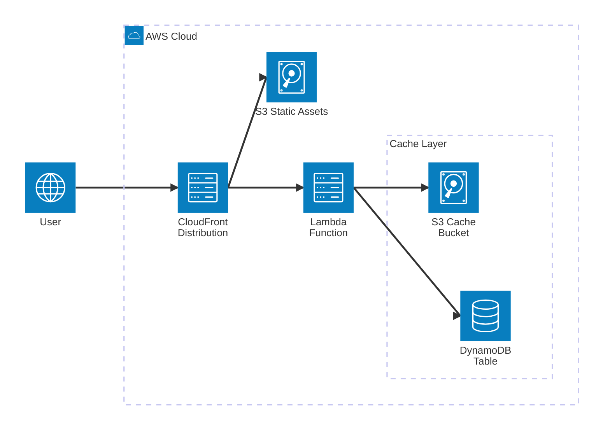
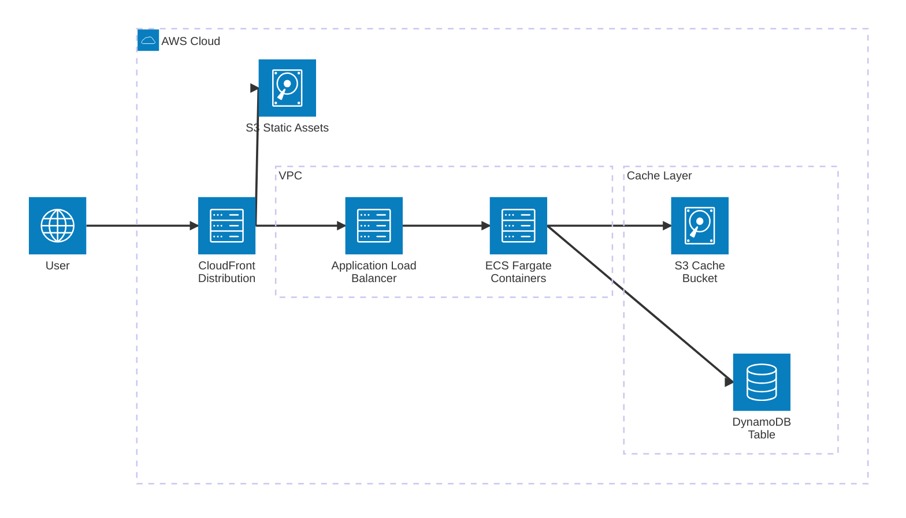
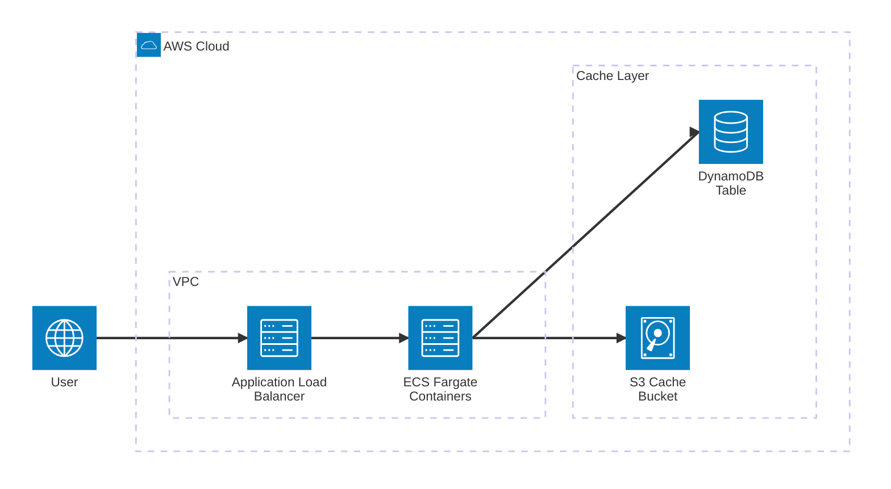
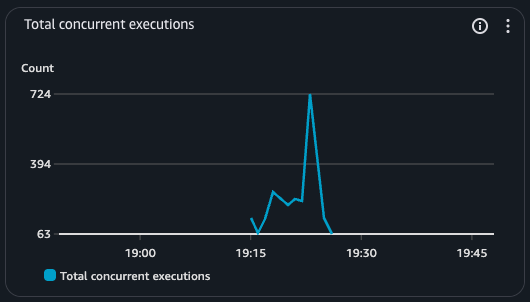

[](https://www.npmjs.org/package/cdk-nextjs)


# CDK Next.js Construct Library

<!--BEGIN STABILITY BANNER-->

---


> The APIs of higher level constructs in this module are experimental and under active development.
> They are subject to non-backward compatible changes or removal in any future version. These are
> not subject to the [Semantic Versioning](https://semver.org/) model and breaking changes will be
> announced in the release notes. This means that while you may use them, you may need to update
> your source code when upgrading to a newer version of this package.

---

<!--END STABILITY BANNER-->

Deploy [Next.js](https://nextjs.org/) apps on [AWS](https://aws.amazon.com/) with the [AWS CDK](https://aws.amazon.com/cdk/).

## Features

- Supports all features of Next.js App and Pages Router for [Node.js Runtime](https://nextjs.org/docs/app/building-your-application/rendering/edge-and-nodejs-runtimes#nodejs-runtime).
- Choose your AWS architecture for Next.js with the supported constructs: `NextjsGlobalFunctions`, `NextjsGlobalContainers`, `NextjsRegionalContainers`, `NextjsRegionalFunctions`.
- Global Content Delivery Network (CDN) built with [Amazon CloudFront](https://aws.amazon.com/cloudfront/) to deliver content with low latency and high transfer speeds.
- Serverless functions powered by [AWS Lambda](https://aws.amazon.com/lambda/) or serverless containers powered by [AWS Fargate](https://aws.amazon.com/fargate/).
- Static assets (JS, CSS, public folder) are stored and served from [Amazon Simple Storage Service (S3)](https://aws.amazon.com/s3/) for all constructs (except `NextjsRegionalContainers`) to decrease latency and reduce compute costs by serving directly from S3.
- [Optimized images](https://nextjs.org/docs/pages/building-your-application/optimizing/images), [data cache](https://nextjs.org/docs/app/building-your-application/caching#data-cache), and [full route cache](https://nextjs.org/docs/app/building-your-application/caching#full-route-cache) are shared across compute with [Amazon Simple Storage Service (S3)](https://aws.amazon.com/s3/) with supporting metadata in [Amazon DynamoDB](https://aws.amazon.com/dynamodb).
- Customize every construct via `overrides`.
- AWS security and operational best practices are utilized, guided by [cdk-nag](https://github.com/cdklabs/cdk-nag).
- First class support for [monorepos](https://monorepo.tools/).
- [AWS GovCloud (US)](https://aws.amazon.com/govcloud-us) compatible with `NextjsRegionalFunctions` and `NextjsRegionalContainers`.

## Prerequisites

- Next.js app running v16.1.1-canary.19 or higher. If you don't have one yet - follow [these steps](https://nextjs.org/docs/getting-started) to create one.
- [AWS Cloud Development Kit](https://docs.aws.amazon.com/cdk/v2/guide/home.html) app either in the same package or separate package. cdk-nextjs supports monorepos.
- Docker compatible container engine - we recommend [Rancher Desktop](https://rancherdesktop.io/) with dockerd (moby).
- [Node.js](https://nodejs.org/en) v24 (or LTS)

## Getting Started

1. Install `cdk-nextjs` in the package(s) containing your CDK and Next.js app with `npm i cdk-nextjs`
2. Update next.config.ts to include `experimental.adapterPath`:

```ts
import { NextConfig } from "next";

const nextConfig: NextConfig = {
  // ...
  experimental: {
    adapterPath: import.meta.resolve("cdk-nextjs/adapter"), // for ESM
    // adapterPath: require.resolve("cdk-nextjs/adapter"), // for CJS
  },
};

export default nextConfig;
```

3. Deploy your Next.js app to AWS: `cdk deploy`. Make sure you have [AWS credentials](https://docs.aws.amazon.com/cli/v1/userguide/cli-chap-configure.html) configured.
4. Visit URL printed in terminal (CloudFormation Output) to view your Next.js app!

### cdk-nextjs Created Dockerfile

cdk-nextjs will generate a Dockerfile in your Next.js app's directory. cdk-nextjs does not have the ability to clean up the Dockerfile after the container is built so you can either add it to source control or gitignore it. When detectd, cdk-nextjs will not overwrite this Dockerfile so you're free to customize it.

## Basic Example CDK App

```ts
import { App, Stack, StackProps } from "aws-cdk-lib";
import { Construct } from "constructs";
import { NextjsGlobalFunctions } from "cdk-nextjs";
import { join } from "node:path";

class WebStack extends Stack {
  constructor(scope: Construct, id: string, props?: StackProps) {
    super(scope, id, props);
    new NextjsGlobalFunctions(this, "Nextjs", {
      buildDirectory: join(import.meta.dirname),
      healthCheckPath: "/api/health",
    });
  }
}

const app = new App();

new WebStack(app, "web-stack");
```

See [examples/](./examples/) for more usage examples.

## Configuration

cdk-nextjs supports configuration via environment variables. These are automatically set by the construct during deployment, but you can override them for custom behavior.

### Cache Configuration

#### `CDK_NEXTJS_MEMORY_CACHE_TTL_MS`

Time to live in milliseconds for in-memory cache entries. After this duration, entries expire and are removed from the cache.

**Important**: Due to the distributed nature of compute instances (Lambda functions, ECS Fargate containers, etc.), the memory cache by default provides eventual consistency across instances. Tag revalidations will clear the cache on the instance that processes the revalidation, but other instances may serve stale data until their cache entries expire. If you require strong consistency, set this to `0` to disable the memory cache (all requests will fall through to S3 + DynamoDB).

**Default**: `3600000` (1 hour)

**Examples**:

- Short TTL (5 minutes): `300000` - for frequently changing data
- Medium TTL (1 hour): `3600000` - balanced between freshness and performance
- Long TTL (24 hours): `86400000` - for mostly static content

**Trade-offs**:

- Lower values: More cache misses, fresher data, higher S3/DynamoDB costs
- Higher values: Fewer cache misses, better performance, but longer stale data windows

#### `CDK_NEXTJS_MEMORY_CACHE_MAX_ENTRIES`

Maximum number of cache entries to store in memory. When this limit is reached, the least recently used (LRU) entry is evicted.

**Default**: `1000`

**Examples**:

- Small cache: `100` - minimal memory footprint for simple apps
- Medium cache: `1000` - good balance for typical applications
- Large cache: `10000` - for high-traffic apps with many unique pages

**Trade-offs**:

- Lower values: Less memory usage, more cache evictions
- Higher values: More memory usage, fewer cache evictions, better hit rates

**Memory considerations**: Each entry stores the full cache value (HTML, JSON, etc.). A typical page cache might be 10-100KB, so 1000 entries ≈ 10-100MB of memory. Consider your compute environment's memory limits (Lambda: 128MB-10GB, Fargate: 512MB-30GB) and size accordingly.

### Infrastructure Configuration

The following environment variables are automatically set by the construct and typically don't need to be modified:

#### `CDK_NEXTJS_BUILD_ID`

Unique identifier for the Next.js build. Used for cache isolation between deployments.

#### `CDK_NEXTJS_CACHE_BUCKET_NAME`

S3 bucket name for storing cached data (optimized images, data cache, full route cache).

#### `CDK_NEXTJS_REVALIDATION_TABLE_NAME`

DynamoDB table name for tracking cache revalidations and tag-to-cache-key mappings.

#### `DEBUG`

Set to `cdk-nextjs:*` to set debug logs. This is especially useful to see cache handler activity.

## Architecture

### `NextjsGlobalFunctions`

Architecture includes [AWS Lambda](https://docs.aws.amazon.com/lambda/latest/dg/welcome.html) Functions to respond to dynamic requests and [CloudFront](https://docs.aws.amazon.com/AmazonCloudFront/latest/DeveloperGuide/Introduction.html) Distribution to globally serve requests and distribute static assets. Use this construct when you have unpredictable traffic, can afford occasional latency (i.e. cold starts - [typically 1% of production traffic](https://aws.amazon.com/blogs/compute/operating-lambda-performance-optimization-part-1/)), and/or want the most granular pricing model. ([code](./src/root-constructs/nextjs-global-functions.ts))


```mermaid
architecture-beta
    group aws(cloud)[AWS Cloud]
    group cache[Cache Layer] in aws

    service user(internet)[User]
    service cloudfront(server)[CloudFront Distribution] in aws
    service s3static(disk)[S3 Static Assets] in aws
    service lambda(server)[Lambda Function] in aws
    service dynamodb(database)[DynamoDB Table] in cache
    service s3cache(disk)[S3 Cache Bucket] in cache

    user:R --> L:cloudfront
    cloudfront:R --> L:s3static
    cloudfront:R --> L:lambda
    lambda:R --> L:dynamodb
    lambda:R --> L:s3cache
```

### `NextjsGlobalContainers`

Architecture includes [ECS Fargate](https://docs.aws.amazon.com/AmazonECS/latest/developerguide/AWS_Fargate.html) containers to respond to dynamic requests and [CloudFront](https://docs.aws.amazon.com/AmazonCloudFront/latest/DeveloperGuide/Introduction.html) Distribution to globally serve requests and distribute static assets. Use this option when you have predictable traffic, need the lowest latency, and/or can afford a less granular pricing model. ([code](./src/root-constructs/nextjs-global-containers.ts))


```mermaid
architecture-beta
    group aws(cloud)[AWS Cloud]
    group vpc[VPC] in aws
    group cache[Cache Layer] in aws

    service user(internet)[User]
    service cloudfront(server)[CloudFront Distribution] in aws
    service s3static(disk)[S3 Static Assets] in aws
    service alb(server)[Application Load Balancer] in vpc
    service fargate(server)[ECS Fargate Containers] in vpc
    service dynamodb(database)[DynamoDB Table] in cache
    service s3cache(disk)[S3 Cache Bucket] in cache

    user:R --> L:cloudfront
    cloudfront:R --> L:s3static
    cloudfront:R --> L:alb
    alb:R --> L:fargate
    fargate:R --> L:dynamodb
    fargate:R --> L:s3cache
```

### `NextjsRegionalContainers`

Architecture includes [ECS Fargate](https://docs.aws.amazon.com/AmazonECS/latest/developerguide/AWS_Fargate.html) containers to respond to dynamic requests and [Application Load Balancer](https://aws.amazon.com/elasticloadbalancing/application-load-balancer/) to regionally serve requests. Use this options when you cannot use Amazon CloudFront (i.e. [AWS GovCloud](https://aws.amazon.com/govcloud-us/?whats-new.sort-by=item.additionalFields.postDateTime&whats-new.sort-order=desc)). ([code](./src/root-constructs/nextjs-regional-containers.ts#L41))


```mermaid
architecture-beta
    group aws(cloud)[AWS Cloud]
    group vpc[VPC] in aws
    group cache[Cache Layer] in aws

    service user(internet)[User]
    service alb(server)[Application Load Balancer] in vpc
    service fargate(server)[ECS Fargate Containers] in vpc
    service dynamodb(database)[DynamoDB Table] in cache
    service s3cache(disk)[S3 Cache Bucket] in cache

    user:R --> L:alb
    alb:R --> L:fargate
    fargate:R --> L:dynamodb
    fargate:R --> L:s3cache
```

### `NextjsRegionalFunctions`

Architecture includes [AWS Lambda](https://docs.aws.amazon.com/lambda/latest/dg/welcome.html) Functions to respond to dynamic requests and [API Gateway REST API](https://docs.aws.amazon.com/apigateway/latest/developerguide/apigateway-rest-api.html) to regionally serve requests and distribute static assets. Use this options when you cannot use Amazon CloudFront (i.e. [AWS GovCloud](https://aws.amazon.com/govcloud-us/?whats-new.sort-by=item.additionalFields.postDateTime&whats-new.sort-order=desc)). ([code](./src/root-constructs/nextjs-regional-functions.ts))


```mermaid
architecture-beta
    group aws(cloud)[AWS Cloud]
    group cache[Cache Layer] in aws

    service user(internet)[User]
    service apigateway(server)[API Gateway REST API] in aws
    service s3static(disk)[S3 Static Assets] in aws
    service lambda(server)[Lambda Function] in aws
    service dynamodb(database)[DynamoDB Table] in cache
    service s3cache(disk)[S3 Cache Bucket] in cache

    user:R --> L:apigateway
    apigateway:R --> L:s3static
    apigateway:R --> L:lambda
    lambda:R --> L:dynamodb
    lambda:R --> L:s3cache
```

## Why

The simplest path to deploy Next.js is on [Vercel](https://vercel.com/) - the Platform-as-a-Service company behind Next.js. However, deploying to Vercel can be expensive and some developers want all of their workloads running _directly_ on AWS. Developers can deploy Next.js on AWS through [AWS Amplify Hosting](https://docs.aws.amazon.com/amplify/latest/userguide/ssr-Amplifysupport.html), but Amplify does not support all Next.js features and manages AWS resources for you so they cannot be customized. If Amplify meets your requirements we recommend you use it, but if you want to use all Next.js features or want more visibility into the AWS resources then this construct is for you.

## Design Principles

- Treat Next.js as black box. Minimize reliance on Next.js internal APIs to reduce chance of incompatibility between this construct and future versions of Next.js.
- Security first.
- One architecture does not fit all.
- Enable customization everywhere.

## Limitations

- If using `NextjsGlobalFunctions` or `NextjsGlobalContainers` (which use CloudFront), the number of top level files/directories cannot exceed 25, the max number of behaviors a CloudFront Distribution supports. We recommend you put all of your public assets into one top level directory (i.e. public/static) so you don't reach this limit. See [CloudFront Quotas](https://docs.aws.amazon.com/AmazonCloudFront/latest/DeveloperGuide/cloudfront-limits.html) for more information.
- If using `NextjsGlobalFunctions`, when [revalidating data in Next.js](https://nextjs.org/docs/app/building-your-application/data-fetching/fetching-caching-and-revalidating#on-demand-revalidation) (i.e. [revalidatePath](https://nextjs.org/docs/app/api-reference/functions/revalidatePath)), the CloudFront Cache will still hold stale data. You'll need to use AWS SDK JS V3 [CreateInvalidationCommand](https://docs.aws.amazon.com/AWSJavaScriptSDK/v3/latest/Package/-aws-sdk-client-cloudfront/Class/CreateInvalidationCommand/) to manually invalidate the path in CloudFront. See more [here](https://docs.aws.amazon.com/AmazonCloudFront/latest/DeveloperGuide/Invalidation.html).
- If using `NextjsGlobalFunctions`, setting an Authorization header won't work by default because of Lambda Function URL with IAM Auth is already using the Authorization header. You can use the `AWS_LWA_AUTHORIZATION_SOURCE` environment variable of [AWS Lambda Web Adapter](https://github.com/awslabs/aws-lambda-web-adapter) to set an alternative Authorization header in the client which will then be set to the Authorization header when it reaches your app.
- `NextjsRegionalFunctions` doesn't support streaming because API Gateway doesn't support streaming yet.
- If using `NextjsRegionalFunctions` without a custom domain, API Gateway REST APIs require a [stage name](https://docs.aws.amazon.com/apigateway/latest/developerguide/set-up-stages.html) (default: `/prod`) to be specified. This causes links to pages and static assets to break because they're not prefixed with the stage name. You can work around this issue by specifying [basePath](https://nextjs.org/docs/app/api-reference/config/next-config-js/basePath) in next.config.js as your stage name. Additionally, you'll need to add middleware logic to rewrite requests to include the stage name because API Gateway does not include the stage name in the path passed to Lambda. See [examples/app-playground/middleware.ts](./examples/app-playground/middleware.ts).

## Additional Security Recommendations

This construct by default implements all AWS security best practices that a CDK construct library reasonably can considering cost and complexity. Below are additional security practices we recommend you implement within your CDK app. Please see them below:

- [VPC Flow Logs](https://docs.aws.amazon.com/vpc/latest/userguide/flow-logs.html). See [examples/](./examples) for sample implementation.
- [Scan ECR Images For Vulnerabilities](https://docs.aws.amazon.com/AmazonECR/latest/userguide/image-scanning.html).
- For `NextjsGlobalFunctions` and `NextjsGlobalContainers`, [CloudFront Access Logs](https://docs.aws.amazon.com/AmazonCloudFront/latest/DeveloperGuide/AccessLogs.html). See [examples/](./examples) for sample implementation.
- For `NextjsGlobalContainers` and `NextjsRegionalContainers`, use [ALB HTTPS Listener](https://docs.aws.amazon.com/elasticloadbalancing/latest/application/create-https-listener.html)
- If using `NextjsGlobalContainers` and `NextjsRegionalContainers`, enable `ReadonlyRootFilesystem`. This will remove ability to use Static On-Demand feature of Next.js so it's not enabled by default, but is recommended for security.

## Estimated Costs

### Assumptions

The following basic assumptions were used for a typical medium Next.js app. See [docs/usage.xlsx](./docs/usage.xlsx) for detailed assumptions and usage per construct type that you can plug into AWS Pricing Calculator.

| Metric                                                       | Value |
| ------------------------------------------------------------ | ----- |
| Monthly Active Users                                         | 1K    |
| Pages Visited Per Month Per User                             | 100   |
| Avg Request Size                                             | 50KB  |
| Static Requests Per Page (js, css, etc)                      | 15    |
| Static Requests Cache Hit %                                  | 50%   |
| Static Assets Size                                           | 10GB  |
| Dynamic Requests Per Page (document, optimized images, etc.) | 5     |
| Dynamic Cache Read %                                         | 50%   |
| Dynamic Cache Write %                                        | 5%    |
| Dynamic Cache Data Size                                      | 10GB  |
| Average Dynamic Cache Request Size                           | 100KB |
| Dynamic Revalidate Tag %                                     | 1%    |

More Details:

- Assume ARM architecture for compute
- AWS Region: us-east-1
- Excludes charges related to: CloudWatch Logs, NAT Gateway data processing

### NextjsGlobalFunctions

[AWS Pricing Calculator](https://calculator.aws/#/estimate?id=23611f6fea87ef05d5fe87c33135ddde43b17a98)

| Service    | Monthly Usage                                  | Estimated Monthly Cost (USD) |
| ---------- | ---------------------------------------------- | ---------------------------- |
| Lambda     | 500K requests, 2 GB memory, 150ms avg duration | $0.00 (Always Free Tier)     |
| CloudFront | 2M requests, 100 GB transfer to internet       | $0.00 (Always Free Tier)     |
| S3         | 20 GB storage, 1M GET, 250K PUT requests       | $2.11                        |
| DynamoDB   | 10 GB storage, 5K Reads, 5K Writes             | $2.50                        |
| Total      |                                                | $8.09                        |

### NextjsGlobalContainers

[AWS Pricing Calculator](https://calculator.aws/#/estimate?id=02f0073e612d1eee2a7ccace2c636adc5f0acab7)

| Service     | Monthly Usage                            | Estimated Monthly Cost (USD) |
| ----------- | ---------------------------------------- | ---------------------------- |
| ECS Fargate | 1 task (1 vCPU, 2 GB)                    | $28.44                       |
| ALB         | 1 LB, 1.04GB/hr, 5.79 conn/sec           | $22.50                       |
| CloudFront  | 2M requests, 100 GB transfer to internet | $0.00 (Always Free Tier)     |
| S3          | 20 GB storage, 1M GET, 250K PUT requests | $2.11                        |
| DynamoDB    | 10 GB storage, 5K Reads, 5K Writes       | $2.50                        |
| VPC         | NAT Gateway, 2 AZs                       | $65.70                       |
| Total       |                                          | $121.25                      |

### NextjsRegionalContainers

[AWS Pricing Calculator](https://calculator.aws/#/estimate?id=e214abe60eb4e24fc5866d07ef4355393261af3c)

| Service     | Monthly Usage                              | Estimated Monthly Cost (USD) |
| ----------- | ------------------------------------------ | ---------------------------- |
| ECS Fargate | 1 task (2 vCPU, 4 GB), always on           | $28.44                       |
| ALB         | 1 LB, 4.17 GB/hr, 23.15 conn/sec           | $40.78                       |
| S3          | 10 GB storage, 250K GET, 250K PUT requests | $1.58                        |
| DynamoDB    | 10 GB storage, 5K Reads, 5K Writes         | $2.50                        |
| VPC         | NAT Gateway, 2 AZs                         | $65.70                       |
| Total       |                                            | $139.00                      |

### NextjsRegionalFunctions

[AWS Pricing Calculator](https://calculator.aws/#/estimate?id=60da38c7993c1baeee2fee4bd19ba6441608bb15)

| Service     | Monthly Usage                                  | Estimated Monthly Cost (USD) |
| ----------- | ---------------------------------------------- | ---------------------------- |
| Lambda      | 500K requests, 2 GB memory, 150ms avg duration | $0.00 (Always Free Tier)     |
| API Gateway | 2M requests                                    | $7.00                        |
| S3          | 10 GB storage, 250K GET, 250K PUT requests     | $1.58                        |
| DynamoDB    | 10 GB storage, 5K Reads, 5K Writes             | $2.50                        |
| Total       |                                                | $11.08                       |

## Performance

[Artillery Playwright](https://www.artillery.io/docs/reference/engines/playwright#overview) app playground example load tests results with 1K concurrent users. Reproduce with `pnpm test-fargate:lg` within `examples/load-tests`.

### NextjsGlobalFunctions

<details>
<summary>`NextjsGlobalFunctions` Performance Details</summary>

```bash
browser.page.TTFB.https://abc123.cloudfront.net/isr:
  min: ......................................................................... 6.3
  max: ......................................................................... 5017.4
  mean: ........................................................................ 11.5
  median: ...................................................................... 10.3
  p95: ......................................................................... 15.6
  p99: ......................................................................... 22.9
browser.page.TTFB.https://abc123.cloudfront.net/isr/1:
  min: ......................................................................... 3.2
  max: ......................................................................... 560.6
  mean: ........................................................................ 9.4
  median: ...................................................................... 5.4
  p95: ......................................................................... 11.1
  p99: ......................................................................... 162.4
browser.page.TTFB.https://abc123.cloudfront.net/isr/2:
  min: ......................................................................... 3.1
  max: ......................................................................... 1511.9
  mean: ........................................................................ 9.2
  median: ...................................................................... 5.2
  p95: ......................................................................... 10.7
  p99: ......................................................................... 149.9
browser.page.TTFB.https://abc123.cloudfront.net/isr/3:
  min: ......................................................................... 3.4
  max: ......................................................................... 131.1
  mean: ........................................................................ 7.1
  median: ...................................................................... 5.3
  p95: ......................................................................... 10.1
  p99: ......................................................................... 64.7
browser.page.TTFB.https://abc123.cloudfront.net/ssg:
  min: ......................................................................... 6.4
  max: ......................................................................... 5015.1
  mean: ........................................................................ 11.5
  median: ...................................................................... 10.3
  p95: ......................................................................... 15.6
  p99: ......................................................................... 23.3
browser.page.TTFB.https://abc123.cloudfront.net/ssg/3:
  min: ......................................................................... 2.9
  max: ......................................................................... 98
  mean: ........................................................................ 5.1
  median: ...................................................................... 4.6
  p95: ......................................................................... 8.2
  p99: ......................................................................... 12.8
browser.page.TTFB.https://abc123.cloudfront.net/ssr:
  min: ......................................................................... 6.4
  max: ......................................................................... 5018.6
  mean: ........................................................................ 11.3
  median: ...................................................................... 10.3
  p95: ......................................................................... 15.6
  p99: ......................................................................... 23.3
browser.page.TTFB.https://abc123.cloudfront.net/ssr/2:
  min: ......................................................................... 83.4
  max: ......................................................................... 150.7
  mean: ........................................................................ 119
  median: ...................................................................... 111.1
  p95: ......................................................................... 147
  p99: ......................................................................... 147
browser.page.TTFB.https://abc123.cloudfront.net/streaming:
  min: ......................................................................... 6.4
  max: ......................................................................... 5015.2
  mean: ........................................................................ 11.8
  median: ...................................................................... 10.3
  p95: ......................................................................... 15.6
  p99: ......................................................................... 23.3
```

</details>



### NextjsGlobalContainers

<details>
<summary>`NextjsGlobalContainers` Performance Details</summary>

```bash
TODO
```

</details>

### NextjsRegionalContainers

<details>
<summary>`NextjsRegionalContainers` Performance Details</summary>

```bash
TODO
```

### NextjsRegionalFunctions

<details>
<summary>`NextjsRegionalFunctions` Performance Details</summary>

```bash
TODO
```

</details>

## Guides

- [Caching Guide](./docs/caching-guide.md)
- [Pruning Guide](./docs/pruning-guide.md)
- [Next Build Output Guide](./docs/next-build-output-guide.ts)
- [Development Guide](./docs/development-guide.ts)

## Contributing

Steps to build locally:

1. `git clone https://github.com/cdklabs/cdk-nextjs.git`
2. `cd cdk-nextjs`
3. `pnpm i && pnpm compile && pnpm build`

This project uses Projen, so make sure to not edit [Projen](https://projen.io/) created files and only edit .projenrc.ts.

## FAQ

Q: How does this compare to [cdk-nextjs-standalone](https://github.com/jetbridge/cdk-nextjs)?<br/>
A: cdk-nextjs-standalone relies on [OpenNext](https://github.com/sst/open-next). OpenNext injects custom code to interact with private Next.js APIs. While OpenNext is able to make some optimizations that are great for serverless environments, this comes at an increase maintenance cost and increased chances for breaking changes. A goal of cdk-nextjs is to customize Next.js as little as possible to reduce the maintenance burden and decrease chances of breaking changes.

Q: Why does cdk-nextjs depend upon Next.js v16.1.1-canary.19 or higher?
A: This version is required for [Image Optimization Caching](https://nextjs.org/docs/app/api-reference/config/next-config-js/incrementalCacheHandlerPath#image-optimization-caching) so that cdk-nextjs can depend upon public Next.js API.

Q: How does cdk-nextjs support caching in Next.js?<br/>
A: See [Caching Guide](./docs/caching-guide.md)

Q: How customizable is the `cdk-nextjs` package for different use cases?<br/>
A: The `cdk-nextjs` package offers deep customization through _prop-based_ overrides. These can be accessed in the construct props, allowing you to override settings like VPC configurations, CloudFront distribution, and ECS/Fargate setup. For example, you can modify `nextjsBuildProps` to customize the build process or use `nextjsDistributionProps` to adjust how CloudFront handles caching and routing. This level of control makes it easy to adapt the infrastructure to your application’s specific performance, networking, or deployment needs.

Q: How can I use a custom domain with `cdk-nextjs`?<br/>
A: See [low-cost example](./examples/low-cost/app.ts).

Q: What is difference between `NextjsGlobalFunctionsProps.overrides.nextjsDistribution` and `NextjsGlobalFunctionsProps.overrides.nextjsGlobalFunctions.nextjsDistributionProps`<br/>
A: `NextjsGlobalFunctionsProps.overrides.nextjsDistribution` allows you to customize any construct's props _within_ `NextjsDistribution` and is likely what you want whereas `NextjsGlobalFunctionsProps.overrides.nextjsGlobalFunctions.nextjsDistributionProps` allows you to customize the props passed into the construct: `NextjsDistribution`. This principle also applies to other similarly named overrides.

Q: Why use container image for `NextjsGlobalFunctions`?<br />
A: Read [The case for containers on Lambda (with benchmarks)](https://aaronstuyvenberg.com/posts/containers-on-lambda). Also, we depend upon [AWS Lambda Web Adapter](https://github.com/awslabs/aws-lambda-web-adapter) to transform lambda event payloads into HTTP requests that Next.js expects.

Q: How can I `cdk bootstrap --cloudformation-execution-policies ...` my AWS Account with limited permissions for cdk-nextjs to deploy?<br />
A: See [docs/cdk-nextjs-cfn-exec-policy.json](./docs/cdk-nextjs-cfn-exec-policy.json). Note, this IAM Policy is scoped to all cdk-nextjs constructs so you can remove services if you know the construct you're using doesn't use that service.

## Acknowledgements

This construct was built on the shoulders of giants. Thank you to the contributors of [cdk-nextjs-standalone](https://github.com/jetbridge/cdk-nextjs) and [open-next](https://github.com/sst/open-next).

## 🥂 Thanks Contributors

Thank you for helping other developers deploy Next.js apps on AWS

<a href="https://github.com/cdklabs/cdk-nextjs/graphs/contributors">
  
</a>
