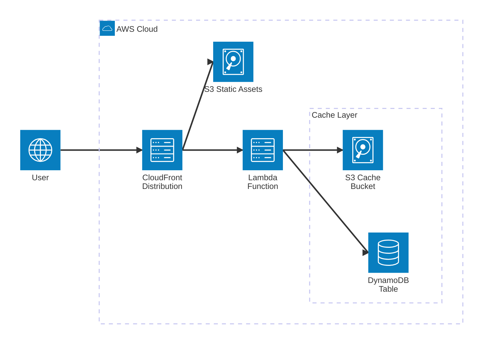
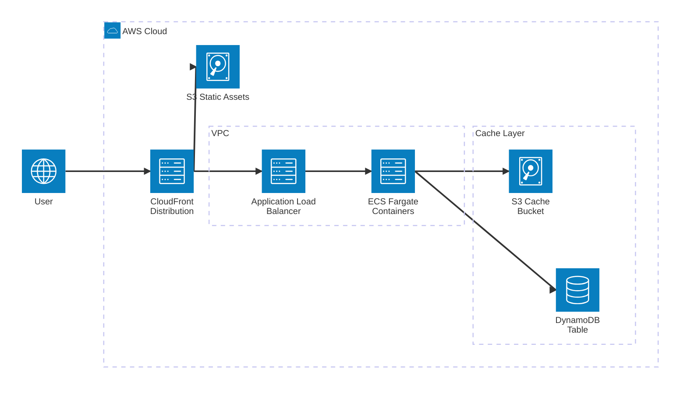
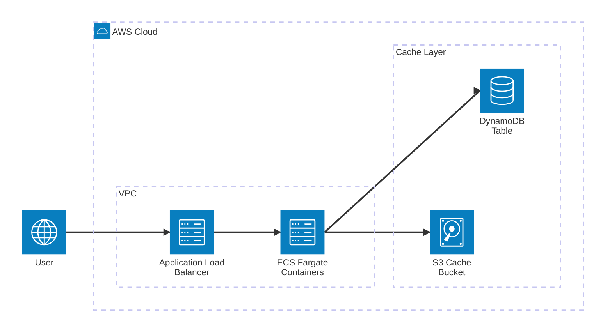

[](https://www.npmjs.org/package/cdk-nextjs)


# CDK Next.js Construct Library

<!--BEGIN STABILITY BANNER-->

---


> The APIs of higher level constructs in this module are experimental and under active development.
> They are subject to non-backward compatible changes or removal in any future version. These are
> not subject to the [Semantic Versioning](https://semver.org/) model and breaking changes will be
> announced in the release notes. This means that while you may use them, you may need to update
> your source code when upgrading to a newer version of this package.

---

<!--END STABILITY BANNER-->

Deploy [Next.js](https://nextjs.org/) apps on [AWS](https://aws.amazon.com/) with the [AWS CDK](https://aws.amazon.com/cdk/).

## Features

- Supports all features of Next.js App and Pages Router for [Node.js Runtime](https://nextjs.org/docs/app/building-your-application/rendering/edge-and-nodejs-runtimes#nodejs-runtime).
- Choose your AWS architecture for Next.js with the supported constructs: `NextjsGlobalFunctions`, `NextjsGlobalContainers`, `NextjsRegionalContainers`, `NextjsRegionalFunctions`.
- Global Content Delivery Network (CDN) built with [Amazon CloudFront](https://aws.amazon.com/cloudfront/) to deliver content with low latency and high transfer speeds.
- Serverless functions powered by [AWS Lambda](https://aws.amazon.com/lambda/) or serverless containers powered by [AWS Fargate](https://aws.amazon.com/fargate/).
- Static assets (JS, CSS, public folder) are stored and served from [Amazon Simple Storage Service (S3)](https://aws.amazon.com/s3/) for all constructs (except `NextjsRegionalContainers`) to decrease latency and reduce compute costs by serving directly from S3.
- [Optimized images](https://nextjs.org/docs/pages/building-your-application/optimizing/images), [data cache](https://nextjs.org/docs/app/building-your-application/caching#data-cache), [full route cache](https://nextjs.org/docs/app/building-your-application/caching#full-route-cache) and [`'use cache: remote'`](https://nextjs.org/docs/app/api-reference/directives/use-cache-remote) are shared across compute with [Amazon Simple Storage Service (S3)](https://aws.amazon.com/s3/) with supporting metadata in [Amazon DynamoDB](https://aws.amazon.com/dynamodb), and `revalidateTag`/`revalidatePath` reach plain [`'use cache'`](https://nextjs.org/docs/app/api-reference/directives/use-cache) on every instance. See [`'use cache'` and `'use cache: remote'`](#use-cache-and-use-cache-remote).
- Customize every construct via `overrides`.
- AWS security and operational best practices are utilized, guided by [cdk-nag](https://github.com/cdklabs/cdk-nag).
- First class support for [monorepos](https://monorepo.tools/).
- [Bring Your Own Resources](#bring-your-own-resources) — import existing AWS resources (CloudFront distributions, ECS clusters, ALBs, S3 buckets, DynamoDB tables).
- [AWS GovCloud (US)](https://aws.amazon.com/govcloud-us) compatible with `NextjsRegionalFunctions` and `NextjsRegionalContainers`.

## Prerequisites

- Next.js app running v16.2 or higher. If you don't have one yet - follow [these steps](https://nextjs.org/docs/getting-started) to create one.
- [AWS Cloud Development Kit](https://docs.aws.amazon.com/cdk/v2/guide/home.html) app either in the same package or separate package. cdk-nextjs supports monorepos.
- A Docker compatible container engine, but **only** for `NextjsGlobalContainers` and `NextjsRegionalContainers` - we recommend [Rancher Desktop](https://rancherdesktop.io/) with dockerd (moby). The two Functions types deploy zip Lambdas and need no container engine.
- [Node.js](https://nodejs.org/en) v24 (or LTS)

## Getting Started

1. Install `cdk-nextjs` in the package(s) containing your CDK and Next.js app with `npm i cdk-nextjs`
2. Deploy your Next.js app to AWS: `cdk deploy`. Make sure you have [AWS credentials](https://docs.aws.amazon.com/cli/v1/userguide/cli-chap-configure.html) configured.
3. Visit URL printed in terminal (CloudFormation Output) to view your Next.js app!

No `next.config` change is needed: cdk-nextjs runs `next build` itself, and sets [`NEXT_ADAPTER_PATH`](https://nextjs.org/docs/app/api-reference/config/next-config-js/adapterPath) on that build so Next.js loads cdk-nextjs's [Deployment Adapter](https://nextjs.org/docs/app/guides/deployment-adapters).

### Registering the adapter yourself

Set `adapterPath` in `next.config` in three cases. An explicit `adapterPath` always wins over `NEXT_ADAPTER_PATH`, so this is also how you pin a specific adapter.

- **cdk-nextjs isn't running your build** — `skipBuild: true`, or you build in CI and hand the output to CDK.
- **cdk-nextjs isn't a dependency of the Next.js app**, only of the CDK app. cdk-nextjs resolves the adapter from your app's directory, so it can't find it in that layout.
- **cdk-nextjs is linked from outside your project root** — a `link:`/`file:` dependency on a checkout elsewhere on disk, as this repo's own examples use. The symlink resolves out of the project, and the adapter derives its cache handler path from its own location, so Next.js gets a `cacheHandler` outside `turbopack.root` and Turbopack rejects it. Setting `adapterPath` fixes this because the build resolves it, after whatever put the adapter in place.

```ts
import { NextConfig } from "next";

const nextConfig: NextConfig = {
  // ...
  adapterPath: require.resolve("cdk-nextjs/adapter"),
};

export default nextConfig;
```

`require.resolve` works in an ESM `next.config.ts` too, because Next.js transpiles the config to CJS before evaluating it.

### cdk-nextjs Created Dockerfile

For the Containers types, cdk-nextjs generates a Dockerfile in your Next.js app's directory. It cannot clean the file up after the image is built, so either commit it or gitignore it.

Every generated Dockerfile starts with the line `# ~~ Generated by cdk-nextjs ~~`, and cdk-nextjs **overwrites** any file carrying it — that way an upgrade that changes how the image is built does not leave a stale Dockerfile behind. To customize it, delete that first line; cdk-nextjs then leaves the file alone.

## Basic Example CDK App

```ts
import { App, Stack, StackProps } from "aws-cdk-lib";
import { Construct } from "constructs";
import { NextjsGlobalFunctions } from "cdk-nextjs";
import { join } from "node:path";

class WebStack extends Stack {
  constructor(scope: Construct, id: string, props?: StackProps) {
    super(scope, id, props);
    new NextjsGlobalFunctions(this, "Nextjs", {
      buildDirectory: join(import.meta.dirname),
    });
  }
}

const app = new App();

new WebStack(app, "web-stack");
```

See [examples/](./examples/) for more usage examples.

## Configuration

The variables below are read at runtime by the cache handler inside your deployed
Lambda functions or containers. Set them on the compute through `overrides`:

```ts
// NextjsGlobalFunctions / NextjsRegionalFunctions
overrides: {
  nextjsFunctions: {
    functionProps: { environment: { CDK_NEXTJS_MEMORY_CACHE_TTL_MS: "0" } },
  },
},

// NextjsGlobalContainers / NextjsRegionalContainers
overrides: {
  nextjsContainers: {
    taskImageOptions: { environment: { CDK_NEXTJS_MEMORY_CACHE_TTL_MS: "0" } },
  },
},
```

Values you pass are merged over the ones the construct sets, so the same mechanism
overrides the [infrastructure variables](#infrastructure-configuration) too.

### Cache Configuration

#### `CDK_NEXTJS_MEMORY_CACHE_TTL_MS`

Time to live in milliseconds for in-memory cache entries. After this duration, entries expire and are removed from the cache.

**Note**: Every memory hit is checked against the DynamoDB revalidation markers (one `BatchGetItem`), so an entry revalidated on another instance is not served from memory. Memory still saves the S3 read and body parse. Set this to `0` to disable the memory cache entirely (all requests will fall through to S3 + DynamoDB).

**Default**: `3600000` (1 hour)

**Examples**:

- Short TTL (5 minutes): `300000` - for frequently changing data
- Medium TTL (1 hour): `3600000` - balanced between freshness and performance
- Long TTL (24 hours): `86400000` - for mostly static content

**Trade-offs**:

- Lower values: More cache misses, fresher data, higher S3/DynamoDB costs
- Higher values: Fewer cache misses, better performance, but longer stale data windows

#### `CDK_NEXTJS_MEMORY_CACHE_MAX_ENTRIES`

Maximum number of cache entries to store in memory. When this limit is reached, the least recently used (LRU) entry is evicted.

**Default**: `1000`

**Examples**:

- Small cache: `100` - minimal memory footprint for simple apps
- Medium cache: `1000` - good balance for typical applications
- Large cache: `10000` - for high-traffic apps with many unique pages

**Trade-offs**:

- Lower values: Less memory usage, more cache evictions
- Higher values: More memory usage, fewer cache evictions, better hit rates

**Memory considerations**: Each entry stores the full cache value (HTML, JSON, etc.). A typical page cache might be 10-100KB, so 1000 entries ≈ 10-100MB of memory. Consider your compute environment's memory limits (Lambda: 128MB-10GB, Fargate: 512MB-30GB) and size accordingly.

### `'use cache'` and `'use cache: remote'`

The adapter registers two [`cacheHandlers`](https://nextjs.org/docs/app/api-reference/config/next-config-js/cacheHandlers)
next to the `cacheHandler` it already sets, unless your `next.config` names a
handler of its own for either:

| Directive             | `cacheHandlers` name | Stored                           | Tags                    |
| --------------------- | -------------------- | -------------------------------- | ----------------------- |
| `'use cache'`         | `default`            | each instance's memory           | DynamoDB, all instances |
| `'use cache: remote'` | `remote`             | S3 cache bucket, memory in front | DynamoDB, all instances |

- **`'use cache: remote'`** is shared: an entry any instance generates is the one
  every instance serves, until it expires or a tag is revalidated. Use it for
  results you don't want each Lambda instance or task to compute on its own. It
  costs an S3 `GetObject` the first time an instance reads an entry, and a
  `PutObject` per generated entry. Objects live under
  `<buildId>/_use-cache/` in the cache bucket and are pruned with the build.
- **`'use cache'`** stays per instance, as Next.js intends — but `revalidateTag`,
  `updateTag` and `revalidatePath` now expire it on every instance, not only the
  one that ran them. Next.js's built-in handler keeps tags in process memory, so
  before this every other instance kept serving the revalidated value, even into
  pages re-rendered because of that revalidation.

Both read the same per-tag marker rows in the revalidation table that ISR and
the data cache use. A tag an instance has not seen yet — an entry read from S3,
a page's implicit `revalidatePath` tags — is read from its marker before it is
trusted, once per instance.

After that, an instance doesn't re-read the tags it tracks to learn what
changed. Each `revalidateTag`/`updateTag` also writes a row to a revalidation
log in the same table (`pk = <buildId>#log`, expiring after 15 minutes through
the table's `ttl` attribute). At most once per
[`CDK_NEXTJS_USE_CACHE_TAG_REFRESH_MS`](#cdk_nextjs_use_cache_tag_refresh_ms),
each instance sends one DynamoDB `Query` for the rows written since its last
one and applies those for tags it tracks. So a revalidation on another instance
is honored within that window (1 second by default), and on the instance that ran
it immediately. An idle instance's query costs 0.5 RCU a second, where
re-reading up to 1000 tracked tags cost about 500. Each tag's marker is still
re-read every 10 minutes, a few each second rather than all at once (about 8
RCU a second at the most an instance tracks, 10,000 tags). After a gap the log
may no longer cover (a Lambda frozen between invocations, a run of failed
queries), an instance forgets its tracked markers and reads each again as it's
needed. ISR and the data cache catch up on revalidations from the
same log, once per
[`CDK_NEXTJS_TAG_MARKER_TTL_MS`](./docs/caching-guide.md#on-demand-revalidation).

If you pass your own `revalidationTable`, enable TTL on its `ttl` attribute, or
the log rows (about 100 bytes per revalidated tag) are kept until the build is
replaced and the table is cleaned up by hand.

Two instances that generate the same `'use cache: remote'` entry at the same
moment both store it; each serves its own copy until that copy's `revalidate`
time, after which S3's is used.

#### `CDK_NEXTJS_USE_CACHE_TAG_REFRESH_MS`

How often, at most, in milliseconds, an instance asks the revalidation log what
other instances revalidated: the longest a `revalidateTag` elsewhere goes unseen.
It's one DynamoDB `Query`, however many tags the instance tracks, shared by every
request on the instance during the window. `0` asks before every request that
uses a cache.

**Default**: `1000`

#### `CDK_NEXTJS_USE_CACHE_MEMORY_BYTES`

Size bound, in bytes, of each handler's in-memory store: all of `'use cache'`,
and the memory tier in front of S3 for `'use cache: remote'`. Least recently used
entries are evicted first.

**Default**: `52428800` (50 MB, Next.js's own default)

### Infrastructure Configuration

The construct sets these itself (`CDK_NEXTJS_BASE_PATH` only where noted) and they
typically don't need to be modified:

#### `CDK_NEXTJS_BUILD_ID`

Unique identifier for the Next.js build. Used for cache isolation between deployments.

#### `CDK_NEXTJS_CACHE_BUCKET_NAME`

S3 bucket name for storing cached data (optimized images, data cache, full route cache, `'use cache: remote'`).

#### `CDK_NEXTJS_REVALIDATION_TABLE_NAME`

DynamoDB table name for tracking cache revalidations and tag-to-cache-key mappings.

#### `CDK_NEXTJS_BASE_PATH`

Your app's `basePath`, set only on the CloudFront-fronted constructs
(`NextjsGlobalFunctions`, `NextjsGlobalContainers`) and only when the app has
one. `revalidateTag`/`revalidatePath` invalidate the CDN by route — Next.js
strips `basePath` before routing, so the cache handler never sees it — and this
adds it back to reach the URI CloudFront actually cached.

#### `DEBUG`

Not set by default. Set it to `cdk-nextjs:*` to enable debug logs. This is especially useful to see cache handler activity.

### `next.config.js` options cdk-nextjs reads

Both are read out of your build, so you set them in one place — your app — and the
infrastructure follows.

#### `basePath`

Becomes the S3 key prefix for static assets and the prefix on every CloudFront
cache behavior. See [Resource Isolation](#resource-isolation); the `basePath`
prop only exists to be explicit about it.

#### `assetPrefix`

- **A path** (`assetPrefix: "/cdn"`) — Next.js emits bundle URLs as
  `/cdn/_next/static/...`, on top of `basePath` rather than under it, while the
  objects stay in S3 under `<basePath>/_next/static/...`. `NextjsGlobalFunctions`
  and `NextjsGlobalContainers` add a cache behavior for
  `<assetPrefix>/_next/static*` pointing at the assets bucket, with a CloudFront
  Function that rewrites the prefix back to the S3 keys. It costs one of the 25
  cache behaviors cdk-nextjs budgets for you. **Not supported on
  `NextjsRegionalFunctions` or `NextjsRegionalContainers`** — nothing there maps
  the prefix back, so bundles would 404; synth warns if your app sets one.
- **An absolute URL** (`assetPrefix: "https://cdn.example.com"`) — names an origin
  cdk-nextjs doesn't serve, so nothing is added, on any construct. Point that host
  at the assets bucket yourself, including the `basePath` prefix the objects are
  stored under.
- **An absolute URL with a path** (`assetPrefix: "https://cdn.example.com/cdn"`) —
  its path is treated exactly like the path case above, because `next build`
  compiles a `/cdn/_next/:path+` rewrite of its own: `next start` serves bundles
  under that path too, so the Global constructs answer there as well. Useful when
  that host is a second domain on the same distribution.

## Splitting a Large App Across Functions

Only for `NextjsGlobalFunctions` and `NextjsRegionalFunctions`, and only if you
need it. AWS Lambda caps a function's unzipped code at 250 MB. If your app
exceeds it, cdk-nextjs fails at synth with the measured size and points you here:

```
Function group "default" is 274 MB unzipped, over Lambda's 250 MB limit. Use the
`functionGroups` prop to package routes into separate functions. Note that
splitting only removes route-local code — anything reachable from a shared layout
or the `next` runtime is in every group.
```

`functionGroups` declares which routes get their own Lambda. Everything you do
not name stays on the `default` function:

```ts
new NextjsGlobalFunctions(this, "Nextjs", {
  buildDirectory: join(import.meta.dirname, "..", "web"),
  functionGroups: [
    { name: "reports", routes: ["/dashboard/reports/**"] },
    { name: "admin", routes: ["/admin", "/admin/**", "/settings"] },
  ],
});
```

Each group becomes one Lambda function containing only the routes it owns (plus
the framework closure every function needs), and one CloudFront behavior — or API
Gateway resource, for `NextjsRegionalFunctions` — per pattern.

**Route patterns** are either an exact path (`/settings`) or a subtree
(`/admin/**`). A subtree owns what is _under_ it, not the path itself:
`/admin/**` does not claim `/admin`. To own a page and everything under it, list
both, as the example above does: `["/admin", "/admin/**"]`. Where two groups
could both match, the longest pattern wins, so `/api/**` and `/api/reports/**`
can coexist in different groups. Dynamic segments (`/blog/[slug]`), route group
segments (`/(marketing)/about`), `/`, and `/**` are rejected at synth —
CloudFront matches literal path prefixes and cannot express them. `/index` is
accepted for an App Router `app/index/page.tsx`, but not for a Pages Router home
page, which is the same file as `/`.

**What is routed for you.** Patterns decide which _files_ a group packages; the
edge then has to send every URL those files serve to that group. cdk-nextjs
derives these without extra patterns:

- A Pages Router page's data URL, `/_next/data/<buildId>/<page>.json`. The
  behavior carries the literal build ID, so it changes on every deploy; a
  client still on the previous build falls through to the `default` function,
  which answers 404, and the Next.js client reloads the page.
- The `trailingSlash` form of an exact pattern (`/pricing/`). API Gateway cannot
  express it; `NextjsRegionalFunctions` warns instead.
- The parent of an optional catch-all. `/shop/**` moving
  `app/shop/[[...slug]]/page.tsx` also routes `/shop`, which the same file
  serves. Do not add `/shop` yourself: it matches no route and is rejected.
- An [interception route](https://nextjs.org/docs/app/api-reference/file-conventions/intercepting-routes)
  is packaged with the group that owns the URL it intercepts, not by its own
  path: `app/feed/(..)photo/[id]` follows `/photo/[id]`, because a soft
  navigation requests `/photo/1` and Next.js rewrites it in whichever function
  receives it.

**What synth rejects.** After assigning routes, cdk-nextjs replays the
CloudFront behaviors over every URL each file serves and fails when one would
reach a function without its file, naming the file, the URL and the pattern to
add. That covers:

- A file behind several templates that a pattern only partly covers — root
  params (`app/[locale]/page.tsx` prerendered as `/en` and `/de`) grouped with
  `/en` alone. A dynamic first segment can never be routed, so such a file stays
  in `default`.
- An intercepted URL space split between groups (`/photo/[id]` in one,
  `/photo/1` in another), since the intercepting file cannot be in both.
- A `next.config` rewrite whose source reaches one group and whose destination
  file is in another: rewrites run inside the function that received the
  request. Only rewrites with a literal destination are checked.
- A group pattern that duplicates a top-level `public/` entry's behavior
  (`public/docs/` and `/docs/**`), or sits under one (`/docs/guide/**`), which
  would send the group's routes to S3.

Not checked, because it is only known at request time: **a middleware
`NextResponse.rewrite()`** to a route in another group reaches the function that
received the original URL, which answers 500 for a file it lacks. Keep a
middleware rewrite's source and destination in the same group. The same goes
for a `next.config` rewrite whose destination is built from its parameters
(`/b/:slug` → `/blog/:slug`), and for a dynamic segment of a `default` route
that overlaps a group's literal path (`/[section]/intro` against `/docs/**`).
Likewise **a Pages Router `res.revalidate()`** renders the page in the function
that called it, so it can only revalidate pages in its own group; the error
names the group that owns the page. Use `revalidatePath()` or `revalidateTag()`
across groups.

**What splitting does and does not save.** Every function ships the same `next`
runtime closure, so splitting only moves route-_local_ code and its dependencies.
A group whose routes import a large library is worth extracting; splitting an app
in half does not halve either function.

Notes:

- Group names must be valid CDK construct ids (letters, digits, `-`). `default`
  is reserved.
- A pattern that matches no route in the build is a synth error, not a silent
  no-op — it is almost always a typo.
- Cannot be combined with `i18n`: locale-prefixed routes would need one
  CloudFront behavior per locale per pattern.
- Group patterns (and the routes derived from them above) count against the
  same CloudFront behavior budget as your `public/` entries (see
  [Limitations](#limitations)).
- Per-group `overrides` let you size each function independently:
  `{ name: "reports", routes: [...], overrides: { functionProps: { memorySize: 2048 } } }`.

## Architecture

How requests are served inside the compute — the adapter runtime, and where it deliberately differs from `next start` — is in [docs/adapter-runtime.md](./docs/adapter-runtime.md).

### `NextjsGlobalFunctions`

Architecture includes [AWS Lambda](https://docs.aws.amazon.com/lambda/latest/dg/welcome.html) Functions to respond to dynamic requests and [CloudFront](https://docs.aws.amazon.com/AmazonCloudFront/latest/DeveloperGuide/Introduction.html) Distribution to globally serve requests and distribute static assets. Use this construct when you have unpredictable traffic, can afford occasional latency (i.e. cold starts - [typically 1% of production traffic](https://aws.amazon.com/blogs/compute/operating-lambda-performance-optimization-part-1/)), and/or want the most granular pricing model. ([code](./src/root-constructs/nextjs-global-functions.ts))


```mermaid
architecture-beta
    group aws(cloud)[AWS Cloud]
    group cache[Cache Layer] in aws

    service user(internet)[User]
    service cloudfront(server)[CloudFront Distribution] in aws
    service s3static(disk)[S3 Static Assets] in aws
    service lambda(server)[Lambda Function] in aws
    service dynamodb(database)[DynamoDB Table] in cache
    service s3cache(disk)[S3 Cache Bucket] in cache

    user:R --> L:cloudfront
    cloudfront:R --> L:s3static
    cloudfront:R --> L:lambda
    lambda:R --> L:dynamodb
    lambda:R --> L:s3cache
```

### `NextjsGlobalContainers`

Architecture includes [ECS Fargate](https://docs.aws.amazon.com/AmazonECS/latest/developerguide/AWS_Fargate.html) containers to respond to dynamic requests and [CloudFront](https://docs.aws.amazon.com/AmazonCloudFront/latest/DeveloperGuide/Introduction.html) Distribution to globally serve requests and distribute static assets. Use this option when you have predictable traffic, need the lowest latency, and/or can afford a less granular pricing model. ([code](./src/root-constructs/nextjs-global-containers.ts))


```mermaid
architecture-beta
    group aws(cloud)[AWS Cloud]
    group vpc[VPC] in aws
    group cache[Cache Layer] in aws

    service user(internet)[User]
    service cloudfront(server)[CloudFront Distribution] in aws
    service s3static(disk)[S3 Static Assets] in aws
    service alb(server)[Application Load Balancer] in vpc
    service fargate(server)[ECS Fargate Containers] in vpc
    service dynamodb(database)[DynamoDB Table] in cache
    service s3cache(disk)[S3 Cache Bucket] in cache

    user:R --> L:cloudfront
    cloudfront:R --> L:s3static
    cloudfront:R --> L:alb
    alb:R --> L:fargate
    fargate:R --> L:dynamodb
    fargate:R --> L:s3cache
```

### `NextjsRegionalContainers`

Architecture includes [ECS Fargate](https://docs.aws.amazon.com/AmazonECS/latest/developerguide/AWS_Fargate.html) containers to respond to dynamic requests and [Application Load Balancer](https://aws.amazon.com/elasticloadbalancing/application-load-balancer/) to regionally serve requests. Use this options when you cannot use Amazon CloudFront (i.e. [AWS GovCloud](https://aws.amazon.com/govcloud-us/?whats-new.sort-by=item.additionalFields.postDateTime&whats-new.sort-order=desc)). ([code](./src/root-constructs/nextjs-regional-containers.ts#L41))


```mermaid
architecture-beta
    group aws(cloud)[AWS Cloud]
    group vpc[VPC] in aws
    group cache[Cache Layer] in aws

    service user(internet)[User]
    service alb(server)[Application Load Balancer] in vpc
    service fargate(server)[ECS Fargate Containers] in vpc
    service dynamodb(database)[DynamoDB Table] in cache
    service s3cache(disk)[S3 Cache Bucket] in cache

    user:R --> L:alb
    alb:R --> L:fargate
    fargate:R --> L:dynamodb
    fargate:R --> L:s3cache
```

### `NextjsRegionalFunctions`

Architecture includes [AWS Lambda](https://docs.aws.amazon.com/lambda/latest/dg/welcome.html) Functions to respond to dynamic requests and [API Gateway REST API](https://docs.aws.amazon.com/apigateway/latest/developerguide/apigateway-rest-api.html) to regionally serve requests and distribute static assets. Use this options when you cannot use Amazon CloudFront (i.e. [AWS GovCloud](https://aws.amazon.com/govcloud-us/?whats-new.sort-by=item.additionalFields.postDateTime&whats-new.sort-order=desc)). ([code](./src/root-constructs/nextjs-regional-functions.ts))


```mermaid
architecture-beta
    group aws(cloud)[AWS Cloud]
    group cache[Cache Layer] in aws

    service user(internet)[User]
    service apigateway(server)[API Gateway REST API] in aws
    service s3static(disk)[S3 Static Assets] in aws
    service lambda(server)[Lambda Function] in aws
    service dynamodb(database)[DynamoDB Table] in cache
    service s3cache(disk)[S3 Cache Bucket] in cache

    user:R --> L:apigateway
    apigateway:R --> L:s3static
    apigateway:R --> L:lambda
    lambda:R --> L:dynamodb
    lambda:R --> L:s3cache
```

## Why

The simplest path to deploy Next.js is on [Vercel](https://vercel.com/) - the Platform-as-a-Service company behind Next.js. However, deploying to Vercel can be expensive and some developers want all of their workloads running _directly_ on AWS. Developers can deploy Next.js on AWS through [AWS Amplify Hosting](https://docs.aws.amazon.com/amplify/latest/userguide/ssr-Amplifysupport.html), but Amplify does not support all Next.js features and manages AWS resources for you so they cannot be customized. If Amplify meets your requirements we recommend you use it, but if you want to use all Next.js features or want more visibility into the AWS resources then this construct is for you.

## Design Principles

- Treat Next.js as black box. Minimize reliance on Next.js internal APIs to reduce chance of incompatibility between this construct and future versions of Next.js.
- Security first.
- One architecture does not fit all.
- Enable customization everywhere.

## Bring Your Own Resources

cdk-nextjs supports importing existing AWS resources instead of creating new ones. This is especially useful for per-branch (MR/PR) environments where you deploy shared infrastructure once and spin up lightweight branch stacks that reuse it.

### Supported Resources

| Resource                    | Prop                 | Available On                                         |
| --------------------------- | -------------------- | ---------------------------------------------------- |
| S3 Cache Bucket             | `cacheBucket`        | All constructs                                       |
| DynamoDB Revalidation Table | `revalidationTable`  | All constructs                                       |
| S3 Static Assets Bucket     | `staticAssetsBucket` | All constructs                                       |
| CloudFront Distribution     | `distribution`       | `NextjsGlobalFunctions`, `NextjsGlobalContainers`    |
| ECS Cluster                 | `ecsCluster`         | `NextjsGlobalContainers`, `NextjsRegionalContainers` |
| ALB                         | `alb`                | `NextjsGlobalContainers`, `NextjsRegionalContainers` |

### Resource Isolation

- **Cache bucket and DynamoDB table** are isolated by `buildId` prefix. Multiple branches safely share one bucket/table with no conflicts.
- **Static assets bucket** — Next.js includes content hashes in static asset filenames, so different branches deploying the same file will produce identical content. It's safe for branches to overwrite each other. If you're already using `basePath` for routing, assets will naturally be prefixed by it — `NextjsGlobalFunctions` and `NextjsGlobalContainers` read the `basePath` out of your Next.js build and use it as the S3 key prefix, since CloudFront serves assets from S3 by request path and the two can't differ. Set the `basePath` prop only if you want to be explicit about it; a value that disagrees with your app's fails at synth.

### Shared ALB and `removeAutoCreatedListener()`

`ApplicationLoadBalancedFargateService` always creates a listener on port 80 — there is no opt-out. When you import an ALB that already has a listener on that port, the duplicate causes a deployment failure. Since CDK doesn't expose a way to prevent this, `removeAutoCreatedListener()` surgically removes the generated CloudFormation resources: the `CfnListener`, its security group ingress rule, rebuilds the ECS service `DependsOn` without the deleted listener, and removes auto-created `CfnOutput` resources:

```ts
const nextjs = new NextjsRegionalContainers(this, "Nextjs", {
  // ...
  alb: sharedAlb,
  ecsCluster: sharedCluster,
});
nextjs.nextjsContainers.removeAutoCreatedListener();
```

### Examples

See [examples/bring-your-own/](./examples/bring-your-own/) for a complete deployable example with shared infrastructure and per-branch host-header routing.

## Preview Environments (Per-Branch Deployments)

cdk-nextjs can deploy ephemeral preview environments per merge request (MR) or pull request (PR). The recommended approach uses subdomain-based routing (`pr-123.app.example.com`) so each preview environment runs the same Next.js build as production — no `basePath` configuration or separate builds required.

See [examples/bring-your-own/](./examples/bring-your-own/) for a fully deployable example using `NextjsRegionalContainers` with a shared ALB, ECS Cluster, S3 buckets, and DynamoDB table — connected via SSM Parameter Store.

### Prerequisites

- Wildcard DNS record: `*.app.example.com` → your routing layer (ALB, CloudFront, API Gateway)
- Wildcard ACM certificate: `*.app.example.com`

### Per-Architecture Recommendations

#### `NextjsGlobalContainers` and `NextjsRegionalContainers` (ALB-based)

Subdomain routing via ALB host-based listener rules. This is the fastest and simplest approach. For `NextjsGlobalContainers`, CloudFront forwards the `Host` header to the ALB origin, so the ALB handles all branch routing — no CloudFront changes needed per branch.

See [examples/bring-your-own/](./examples/bring-your-own/) for the full implementation.

#### `NextjsRegionalFunctions` (API Gateway)

Subdomain routing via API Gateway custom domain mappings.

1. Deploy shared infrastructure once: S3 buckets, DynamoDB table
2. Per branch, deploy a cdk-nextjs stack that imports shared resources and creates its own API Gateway
3. Create an API Gateway custom domain (`pr-123.app.example.com`) mapped to the branch's API stage
4. Tear down the branch stack on MR close

#### `NextjsGlobalFunctions` (Lambda + CloudFront)

Requires a separate cdk-nextjs stack per branch, each with its own CloudFront distribution. CloudFront cannot route to different Lambda Function URL origins based on the `Host` header — origin selection is determined by cache behavior path patterns, not request headers.

1. Deploy shared infrastructure once: S3 buckets, DynamoDB table
2. Per branch, deploy a full cdk-nextjs stack that imports shared resources (`cacheBucket`, `revalidationTable`, `staticAssetsBucket`) but creates its own CloudFront distribution and Lambda function
3. Point `pr-123.app.example.com` DNS to the branch's CloudFront distribution
4. Tear down the branch stack on MR close

Note: CloudFront distributions take several minutes to create/update, so this architecture has the slowest preview environment spin-up time.

## Limitations

- If using `NextjsGlobalFunctions` or `NextjsGlobalContainers` (which use CloudFront), each top level file/directory in `public/` takes a CloudFront cache behavior, and a distribution's default quota is 75 behaviors (cdk-nextjs uses 3 to 6 itself, and counts any a distribution you supply already has). We recommend you put all of your public assets into one top level directory (i.e. public/static) so you don't reach this limit. If you raise the quota for your account, set `maxCacheBehaviors` on the distribution props (`overrides.nextjsGlobalFunctions.nextjsDistributionProps`, or the Containers equivalent) to match. See [CloudFront Quotas](https://docs.aws.amazon.com/AmazonCloudFront/latest/DeveloperGuide/cloudfront-limits.html) for more information.
- If using `NextjsGlobalFunctions` or `NextjsGlobalContainers`, on-demand revalidation ([revalidatePath](https://nextjs.org/docs/app/api-reference/functions/revalidatePath), [revalidateTag](https://nextjs.org/docs/app/api-reference/functions/revalidateTag)) creates the CloudFront invalidations for you (so does the Pages Router's `res.revalidate()`, for the page's HTML and `_next/data` copies), but [invalidations](https://docs.aws.amazon.com/AmazonCloudFront/latest/DeveloperGuide/Invalidation.html) are eventually consistent: until one completes (usually seconds, occasionally minutes), some edge locations can still serve the previous copy.
  - **Burst limit.** CloudFront allows 15 wildcard invalidation paths in progress per distribution, and each page cdk-nextjs invalidates is one wildcard path (`/blog*`). Next.js sends every `revalidatePath`/`revalidateTag` from one request as a single call, one invalidation per cache-life profile, however many pages it covers. A Pages Router `res.revalidate()` sends one invalidation per call, and a page regenerated after a stale-while-revalidate `revalidateTag(tag, profile)` sends one more when it lands. When the quota is full, cdk-nextjs retries the request as a single `/*` (a colder edge, never a stale page). If that is also rejected, it logs `Failed to create CloudFront invalidation` and the page stays stale at the edge until its `s-maxage` expires.
  - **For bulk updates** (a CMS webhook touching many pages), call `revalidateTag` with a tag the pages share, or `revalidatePath` for each page within one request, rather than looping `res.revalidate()`. If you need to know when invalidations are dropped, add a CloudWatch Logs metric filter on that log line.
- If using `NextjsGlobalFunctions`, a client-supplied `Authorization` header does not reach your app: CloudFront signs each request to the Lambda Function URL with SigV4, which uses that header. Send credentials under a different name (e.g. `x-authorization`) and read that header in your app. cdk-nextjs does not rename it for you — it no longer uses [AWS Lambda Web Adapter](https://github.com/awslabs/aws-lambda-web-adapter), so `AWS_LWA_AUTHORIZATION_SOURCE` no longer applies.
- If using `NextjsGlobalFunctions`, a `POST` or `PUT` with a request body must carry an `x-amz-content-sha256` header holding the hex SHA-256 of that body. This is [AWS behavior](https://docs.aws.amazon.com/AmazonCloudFront/latest/DeveloperGuide/private-content-restricting-access-to-lambda.html), not a cdk-nextjs choice: CloudFront signs the origin request to the Lambda Function URL with SigV4 but does not hash the body, and Lambda rejects an unsigned payload with `403 InvalidSignatureException`. Requests from your own pages are handled for you — cdk-nextjs injects a `fetch`/`XMLHttpRequest` wrapper into the client bundle that adds the header, so server actions, route handlers and `fetch` from the browser all work untouched. **Anything that is not that browser bundle has to add the header itself**: `curl`, a mobile app, a webhook provider, another service calling your API routes. Server-to-server callers can compute it with the AWS SDK's `Sha256`, or with `crypto.createHash("sha256").update(body).digest("hex")`. The other three deployment types are unaffected.
- If using `NextjsGlobalFunctions`, a `HEAD` request is answered with `content-length: 0`, whatever length your handler declares. This is Lambda Function URL behavior: the same runtime's declared length reaches the client through API Gateway (`NextjsRegionalFunctions`) and from an ALB, with or without CloudFront in front (the two Containers types).
- Group patterns declared via [`functionGroups`](#splitting-a-large-app-across-functions) also count against the CloudFront behavior limit above.
- If using `NextjsRegionalFunctions` without a custom domain, API Gateway REST APIs require a [stage name](https://docs.aws.amazon.com/apigateway/latest/developerguide/set-up-stages.html) (default: `/prod`) to be specified. This causes links to pages and static assets to break because they're not prefixed with the stage name. You can work around this issue by specifying [basePath](https://nextjs.org/docs/app/api-reference/config/next-config-js/basePath) in next.config.js as your stage name — leave the construct's `basePath` prop unset when you do, since API Gateway strips the stage before matching resources. API Gateway strips the stage from the path it passes to Lambda; cdk-nextjs puts it back for an app whose `basePath` starts with it, reading the stage off each request, so no middleware is needed and a renamed stage needs no configuration. Mapping a custom domain at the root avoids all of this — see [examples/regional-functions/README.md](./examples/regional-functions/README.md#with-a-custom-domain-no-stage-workarounds).

## Additional Security Recommendations

This construct by default implements all AWS security best practices that a CDK construct library reasonably can considering cost and complexity. Below are additional security practices we recommend you implement within your CDK app. Please see them below:

- [VPC Flow Logs](https://docs.aws.amazon.com/vpc/latest/userguide/flow-logs.html). See [examples/](./examples) for sample implementation.
- [Scan ECR Images For Vulnerabilities](https://docs.aws.amazon.com/AmazonECR/latest/userguide/image-scanning.html).
- For `NextjsGlobalFunctions` and `NextjsGlobalContainers`, [CloudFront Access Logs](https://docs.aws.amazon.com/AmazonCloudFront/latest/DeveloperGuide/AccessLogs.html). See [examples/](./examples) for sample implementation.
- For `NextjsGlobalContainers` and `NextjsRegionalContainers`, use [ALB HTTPS Listener](https://docs.aws.amazon.com/elasticloadbalancing/latest/application/create-https-listener.html)
- If using `NextjsGlobalContainers` and `NextjsRegionalContainers`, enable `ReadonlyRootFilesystem`. This will remove ability to use Static On-Demand feature of Next.js so it's not enabled by default, but is recommended for security.

## Estimated Costs

### Assumptions

The following basic assumptions were used for a typical medium Next.js app. See [docs/usage.xlsx](./docs/usage.xlsx) for detailed assumptions and usage per construct type that you can plug into AWS Pricing Calculator.

| Metric                                                       | Value |
| ------------------------------------------------------------ | ----- |
| Monthly Active Users                                         | 1K    |
| Pages Visited Per Month Per User                             | 100   |
| Avg Request Size                                             | 50KB  |
| Static Requests Per Page (js, css, etc)                      | 15    |
| Static Requests Cache Hit %                                  | 50%   |
| Static Assets Size                                           | 10GB  |
| Dynamic Requests Per Page (document, optimized images, etc.) | 5     |
| Dynamic Cache Read %                                         | 50%   |
| Dynamic Cache Write %                                        | 5%    |
| Dynamic Cache Data Size                                      | 10GB  |
| Average Dynamic Cache Request Size                           | 100KB |
| Dynamic Revalidate Tag %                                     | 1%    |

More Details:

- Assume ARM architecture for compute
- AWS Region: us-east-1
- Excludes charges related to: CloudWatch Logs, NAT Gateway data processing

### NextjsGlobalFunctions

[AWS Pricing Calculator](https://calculator.aws/#/estimate?id=23611f6fea87ef05d5fe87c33135ddde43b17a98)

| Service    | Monthly Usage                                  | Estimated Monthly Cost (USD) |
| ---------- | ---------------------------------------------- | ---------------------------- |
| Lambda     | 500K requests, 2 GB memory, 150ms avg duration | $0.00 (Always Free Tier)     |
| CloudFront | 2M requests, 100 GB transfer to internet       | $0.00 (Always Free Tier)     |
| S3         | 20 GB storage, 1M GET, 250K PUT requests       | $2.11                        |
| DynamoDB   | 10 GB storage, 5K Reads, 5K Writes             | $2.50                        |
| Total      |                                                | $8.09                        |

### NextjsGlobalContainers

[AWS Pricing Calculator](https://calculator.aws/#/estimate?id=02f0073e612d1eee2a7ccace2c636adc5f0acab7)

| Service     | Monthly Usage                            | Estimated Monthly Cost (USD) |
| ----------- | ---------------------------------------- | ---------------------------- |
| ECS Fargate | 1 task (1 vCPU, 2 GB)                    | $28.44                       |
| ALB         | 1 LB, 1.04GB/hr, 5.79 conn/sec           | $22.50                       |
| CloudFront  | 2M requests, 100 GB transfer to internet | $0.00 (Always Free Tier)     |
| S3          | 20 GB storage, 1M GET, 250K PUT requests | $2.11                        |
| DynamoDB    | 10 GB storage, 5K Reads, 5K Writes       | $2.50                        |
| VPC         | NAT Gateway, 2 AZs                       | $65.70                       |
| Total       |                                          | $121.25                      |

### NextjsRegionalContainers

[AWS Pricing Calculator](https://calculator.aws/#/estimate?id=e214abe60eb4e24fc5866d07ef4355393261af3c)

| Service     | Monthly Usage                              | Estimated Monthly Cost (USD) |
| ----------- | ------------------------------------------ | ---------------------------- |
| ECS Fargate | 1 task (2 vCPU, 4 GB), always on           | $28.44                       |
| ALB         | 1 LB, 4.17 GB/hr, 23.15 conn/sec           | $40.78                       |
| S3          | 10 GB storage, 250K GET, 250K PUT requests | $1.58                        |
| DynamoDB    | 10 GB storage, 5K Reads, 5K Writes         | $2.50                        |
| VPC         | NAT Gateway, 2 AZs                         | $65.70                       |
| Total       |                                            | $139.00                      |

### NextjsRegionalFunctions

[AWS Pricing Calculator](https://calculator.aws/#/estimate?id=60da38c7993c1baeee2fee4bd19ba6441608bb15)

| Service     | Monthly Usage                                  | Estimated Monthly Cost (USD) |
| ----------- | ---------------------------------------------- | ---------------------------- |
| Lambda      | 500K requests, 2 GB memory, 150ms avg duration | $0.00 (Always Free Tier)     |
| API Gateway | 2M requests                                    | $7.00                        |
| S3          | 10 GB storage, 250K GET, 250K PUT requests     | $1.58                        |
| DynamoDB    | 10 GB storage, 5K Reads, 5K Writes             | $2.50                        |
| Total       |                                                | $11.08                       |

## Performance

Measured with [k6](https://grafana.com/docs/k6/latest/) from EC2 in us-east-1, the region of the stacks under test (one load generator per stack), against a small benchmark app ([`examples/bench-app`](./examples/bench-app)) that makes no calls outside its own stack. Functions run the default 2048 MB Lambda functions. Containers run the default 1 vCPU / 2 GB Fargate tasks, with CPU autoscaling from 2 to 10 tasks added (the default is one task and no autoscaling). Methodology, caveats, and how to reproduce the numbers: [`examples/load-tests`](./examples/load-tests).

What each route measures:

- `static-asset`, `static`, `image`: CloudFront's cache on the Global constructs, and the construct itself on the Regional ones.
- `isr`: the cache until the page is stale (10 s), then a background revalidation through the S3 + DynamoDB cache.
- `ssr`, `stream`, `rsc`, `api`: the construct's compute on every request, on every construct.

<!-- tables generated by `pnpm report` in examples/load-tests -->

| Construct                  | `ssr` at 10 req/s | `ssr` at 50 req/s                         | `ssr` capacity | `isr` capacity | Cold start p50 |
| -------------------------- | ----------------- | ----------------------------------------- | -------------- | -------------- | -------------- |
| `NextjsGlobalFunctions`    | 36 / 103          | 33 / 84                                   | ≥ 6560 req/s   | ≥ 6560 req/s   | 1390 ms        |
| `NextjsGlobalContainers`   | 19 / 44           | 18 / 219                                  | 194 req/s      | ≥ 6400 req/s   | –              |
| `NextjsRegionalContainers` | 22 / 172          | 1972 / 39536 ⚠️ 0.54% errors, 76% dropped | 675 req/s      | ≥ 6075 req/s   | –              |
| `NextjsRegionalFunctions`  | 32 / 114          | 30 / 103                                  | ≥ 6560 req/s   | ≥ 6560 req/s   | 1380 ms        |

_Latency is p50 / p99 in ms, with every route loaded at that rate at once. Capacity is the highest rate sustained with p99 under 1000 ms and under 1% errors._

What this means for choosing one:

- **Functions constructs scale with no sizing.** Both held at least 6,560 req/s of SSR, the load generator's limit, at the same latency as at 10 req/s. The cost is a cold start of about 1.4 s on a new execution environment.
- **Containers constructs are fastest per request but need sizing.** Two 1 vCPU tasks served SSR at 19–22 ms p50 against Lambda's ~30 ms, but tasks take minutes to add. Past capacity they don't degrade gradually: tasks too busy to answer the ALB health check are replaced, which leaves fewer tasks for the same load. Leave headroom.
- **CloudFront carries the Global constructs' cached traffic.** Prerendered pages, ISR hits, images and assets were answered at the edge in 2–3 ms at every rate. On the Regional constructs every request reaches the construct: `NextjsRegionalContainers` serves assets and image optimization from the same tasks, so 50 req/s on every route at once (400 req/s) is already more than two tasks handle.
- **Cached pages scale on every construct.** ISR hits held at least 6,000 req/s on all four: at the edge on the Global constructs, and through the S3 + DynamoDB cache on the Regional ones, where each instance holds a tag's revalidation marker for a second (`CDK_NEXTJS_TAG_MARKER_TTL_MS`, see the [Caching Guide](./docs/caching-guide.md)).

<details>
<summary><code>NextjsGlobalFunctions</code></summary>

Latency per route, p50 / p99 in ms, with every route at the same rate at once:

| Route         | 10 req/s  | 50 req/s  | 250 req/s | 1000 req/s | CDN hits |
| ------------- | --------- | --------- | --------- | ---------- | -------- |
| static-asset  | 2.1 / 4.8 | 2.1 / 4.7 | 2.0 / 4.9 | 2.1 / 11   | 100%     |
| static        | 3.3 / 7.5 | 3.2 / 6.8 | 3.1 / 7.3 | 3.2 / 13   | 100%     |
| isr           | 3.3 / 7.4 | 3.3 / 7.7 | 3.2 / 7.2 | 3.2 / 12   | 100%     |
| ssr           | 36 / 103  | 33 / 84   | 31 / 86   | 29 / 73    | 0%       |
| stream        | 233 / 268 | 230 / 261 | 228 / 259 | 226 / 252  | 0%       |
| stream (TTFB) | 32 / 89   | 29 / 66   | 27 / 65   | 25 / 57    |          |
| rsc           | 32 / 67   | 28 / 61   | 27 / 60   | 25 / 52    | 0%       |
| api           | 29 / 79   | 26 / 55   | 24 / 61   | 23 / 47    | 0%       |
| image         | 3.2 / 6.3 | 3.1 / 6.8 | 3.1 / 7.0 | 3.1 / 12   | 100%     |

Capacity: `isr` ≥ 6560 req/s, `ssr` ≥ 6560 req/s.

Cold start, time to first byte of `/ssr` on a new execution environment: p50 1390 ms, p90 1451 ms (warm: 84 ms).

Browser, p75 in ms, under 50 req/s per route:

| Route  | LCP | TTFB | Client-side navigation |
| ------ | --- | ---- | ---------------------- |
| static | 76  | 13   | 15                     |
| ssr    | 80  | 39   | 53                     |
| isr    | 52  | 8.7  | 12                     |
| stream | 64  | 34   | 38                     |
| image  | 52  | 6.7  | 10                     |

</details>

<details>
<summary><code>NextjsGlobalContainers</code></summary>

Latency per route, p50 / p99 in ms, with every route at the same rate at once:

| Route         | 10 req/s  | 50 req/s  | CDN hits |
| ------------- | --------- | --------- | -------- |
| static-asset  | 1.4 / 3.9 | 1.5 / 3.7 | 100%     |
| static        | 1.9 / 4.8 | 1.8 / 3.7 | 100%     |
| isr           | 2.0 / 4.4 | 1.7 / 4.0 | 100%     |
| ssr           | 19 / 44   | 18 / 219  | 0%       |
| stream        | 217 / 242 | 217 / 359 | 0%       |
| stream (TTFB) | 17 / 45   | 16 / 207  |          |
| rsc           | 12 / 26   | 12 / 86   | 0%       |
| api           | 11 / 23   | 10 / 81   | 0%       |
| image         | 2.0 / 4.7 | 1.7 / 4.1 | 100%     |

Capacity: `isr` ≥ 6400 req/s, `ssr` 194 req/s.

Browser, p75 in ms, under 50 req/s per route:

| Route  | LCP | TTFB | Client-side navigation |
| ------ | --- | ---- | ---------------------- |
| static | 88  | 12   | 17                     |
| ssr    | 80  | 26   | 39                     |
| isr    | 56  | 6.1  | 13                     |
| stream | 64  | 20   | 25                     |
| image  | 52  | 5.4  | 11                     |

</details>

<details>
<summary><code>NextjsRegionalContainers</code></summary>

Latency per route, p50 / p99 in ms, with every route at the same rate at once:

| Route         | 10 req/s  | 50 req/s                                  | CDN hits |
| ------------- | --------- | ----------------------------------------- | -------- |
| static-asset  | 18 / 159  | 1698 / 28824 ⚠️ 0.40% errors, 72% dropped | no CDN   |
| static        | 41 / 163  | 916 / 28298 ⚠️ 0.46% errors, 66% dropped  | no CDN   |
| isr           | 40 / 169  | 697 / 27146 ⚠️ 0.36% errors, 57% dropped  | no CDN   |
| ssr           | 22 / 172  | 1972 / 39536 ⚠️ 0.54% errors, 76% dropped | no CDN   |
| stream        | 221 / 354 | 1909 / 27423 ⚠️ 0.44% errors, 72% dropped | no CDN   |
| stream (TTFB) | 19 / 166  | 1881 / 27162                              |          |
| rsc           | 9.4 / 64  | 433 / 26066 ⚠️ 0.25% errors, 39% dropped  | no CDN   |
| api           | 6.9 / 55  | 429 / 26041 ⚠️ 0.25% errors, 38% dropped  | no CDN   |
| image         | 140 / 440 | 1599 / 27489 ⚠️ 0.22% errors, 69% dropped | no CDN   |

Capacity: `isr` ≥ 6075 req/s, `ssr` 675 req/s.

Browser, p75 in ms, under 10 req/s per route. `static` is each visit's first page: on a plain-HTTP origin, Chrome tries HTTPS first and falls back after about 3 s (HTTPS-Upgrades), which real visitors pay too. Put a certificate on the ALB to avoid it.

| Route  | LCP  | TTFB | Client-side navigation |
| ------ | ---- | ---- | ---------------------- |
| static | 3100 | 3047 | 16                     |
| ssr    | 68   | 14   | 27                     |
| isr    | 88   | 43   | 13                     |
| stream | 48   | 11   | 13                     |
| image  | 212  | 38   | 9.6                    |

</details>

<details>
<summary><code>NextjsRegionalFunctions</code></summary>

Latency per route, p50 / p99 in ms, with every route at the same rate at once:

| Route         | 10 req/s  | 50 req/s  | 250 req/s | 1000 req/s | CDN hits |
| ------------- | --------- | --------- | --------- | ---------- | -------- |
| static-asset  | 34 / 76   | 32 / 72   | 30 / 72   | 30 / 68    | no CDN   |
| static        | 58 / 138  | 57 / 140  | 57 / 147  | 57 / 127   | no CDN   |
| isr           | 58 / 149  | 56 / 124  | 56 / 145  | 55 / 125   | no CDN   |
| ssr           | 32 / 114  | 30 / 103  | 29 / 115  | 29 / 98    | no CDN   |
| stream        | 229 / 293 | 227 / 288 | 227 / 299 | 226 / 282  | no CDN   |
| stream (TTFB) | 27 / 85   | 25 / 84   | 25 / 97   | 24 / 76    |          |
| rsc           | 27 / 76   | 26 / 73   | 25 / 83   | 25 / 70    | no CDN   |
| api           | 24 / 84   | 22 / 70   | 22 / 97   | 22 / 67    | no CDN   |
| image         | 127 / 210 | 125 / 221 | 125 / 236 | 123 / 211  | no CDN   |

Capacity: `isr` ≥ 6560 req/s, `ssr` ≥ 6560 req/s.

Cold start, time to first byte of `/ssr` on a new execution environment: p50 1380 ms, p90 1442 ms (warm: 71 ms).

Browser, p75 in ms, under 50 req/s per route:

| Route  | LCP | TTFB | Client-side navigation |
| ------ | --- | ---- | ---------------------- |
| static | 128 | 70   | 17                     |
| ssr    | 88  | 35   | 50                     |
| isr    | 108 | 62   | 13                     |
| stream | 64  | 31   | 36                     |
| image  | 220 | 60   | 9.6                    |

</details>

## Guides

- [Caching Guide](./docs/caching-guide.md)
- [Pruning Guide](./docs/pruning-guide.md)
- [Next Build Output Guide](./docs/next-build-output-guide.ts)
- [Development Guide](./docs/development-guide.ts)

## Contributing

Steps to build locally:

1. `git clone https://github.com/cdklabs/cdk-nextjs.git`
2. `cd cdk-nextjs`
3. `pnpm i && pnpm compile && pnpm build`

This project uses Projen, so make sure to not edit [Projen](https://projen.io/) created files and only edit .projenrc.ts.

## FAQ

Q: How does this compare to [cdk-nextjs-standalone](https://github.com/jetbridge/cdk-nextjs)?<br/>
A: cdk-nextjs-standalone relies on [OpenNext](https://github.com/sst/open-next). OpenNext injects custom code to interact with private Next.js APIs. While OpenNext is able to make some optimizations that are great for serverless environments, this comes at an increase maintenance cost and increased chances for breaking changes. A goal of cdk-nextjs is to customize Next.js as little as possible to reduce the maintenance burden and decrease chances of breaking changes.

Q: Why does cdk-nextjs depend upon Next.js v16.2 or higher?
A: This version is required for [Image Optimization Caching](https://nextjs.org/docs/app/api-reference/config/next-config-js/incrementalCacheHandlerPath#image-optimization-caching) so that cdk-nextjs can depend upon public Next.js API.

Q: How does cdk-nextjs support caching in Next.js?<br/>
A: See [Caching Guide](./docs/caching-guide.md)

Q: How customizable is the `cdk-nextjs` package for different use cases?<br/>
A: The `cdk-nextjs` package offers deep customization through _prop-based_ overrides. These can be accessed in the construct props, allowing you to override settings like VPC configurations, CloudFront distribution, and ECS/Fargate setup. For example, you can modify `nextjsBuildProps` to customize the build process or use `nextjsDistributionProps` to adjust how CloudFront handles caching and routing. This level of control makes it easy to adapt the infrastructure to your application’s specific performance, networking, or deployment needs.

Q: How can I use a custom domain with `cdk-nextjs`?<br/>
A: See [low-cost example](./examples/low-cost/app.ts).

Q: What is difference between `NextjsGlobalFunctionsProps.overrides.nextjsDistribution` and `NextjsGlobalFunctionsProps.overrides.nextjsGlobalFunctions.nextjsDistributionProps`<br/>
A: `NextjsGlobalFunctionsProps.overrides.nextjsDistribution` allows you to customize any construct's props _within_ `NextjsDistribution` and is likely what you want whereas `NextjsGlobalFunctionsProps.overrides.nextjsGlobalFunctions.nextjsDistributionProps` allows you to customize the props passed into the construct: `NextjsDistribution`. This principle also applies to other similarly named overrides.

Q: How can I `cdk bootstrap --cloudformation-execution-policies ...` my AWS Account with limited permissions for cdk-nextjs to deploy?<br />
A: See [docs/cdk-nextjs-cfn-exec-policy.json](./docs/cdk-nextjs-cfn-exec-policy.json). Note, this IAM Policy is scoped to all cdk-nextjs constructs so you can remove services if you know the construct you're using doesn't use that service.

## Acknowledgements

This construct was built on the shoulders of giants. Thank you to the contributors of [cdk-nextjs-standalone](https://github.com/jetbridge/cdk-nextjs) and [open-next](https://github.com/sst/open-next).

## 🥂 Thanks Contributors

Thank you for helping other developers deploy Next.js apps on AWS

<a href="https://github.com/cdklabs/cdk-nextjs/graphs/contributors">
  
</a>
