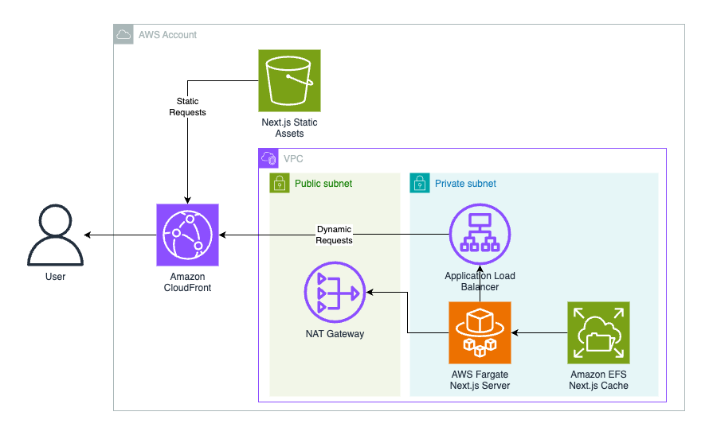
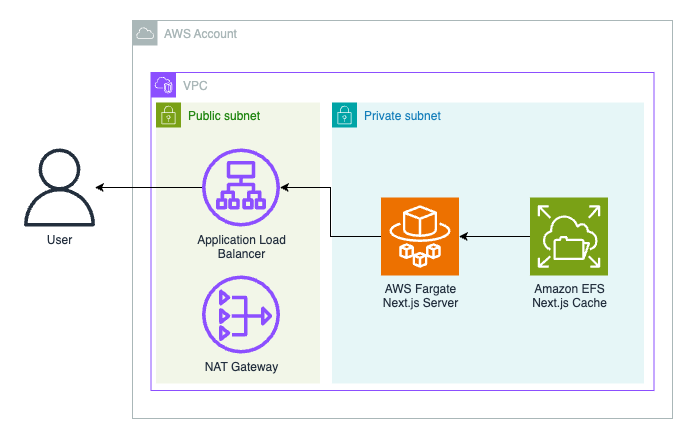

[](https://www.npmjs.org/package/cdk-nextjs)


# CDK Next.js Construct Library

<!--BEGIN STABILITY BANNER-->

---


> The APIs of higher level constructs in this module are experimental and under active development.
> They are subject to non-backward compatible changes or removal in any future version. These are
> not subject to the [Semantic Versioning](https://semver.org/) model and breaking changes will be
> announced in the release notes. This means that while you may use them, you may need to update
> your source code when upgrading to a newer version of this package.

---

<!--END STABILITY BANNER-->

Deploy [Next.js](https://nextjs.org/) apps on [AWS](https://aws.amazon.com/) with the [AWS CDK](https://aws.amazon.com/cdk/).

## Features

- Supports all features of Next.js App and Pages Router for [Node.js Runtime](https://nextjs.org/docs/app/building-your-application/rendering/edge-and-nodejs-runtimes#nodejs-runtime)
- Choose your AWS architecture for Next.js with the supported constructs: `NextjsGlobalFunctions`, `NextjsGlobalContainers`, `NextjsRegionalContainers`.
- Global Content Delivery Network (CDN) built with [Amazon CloudFront](https://aws.amazon.com/cloudfront/) to deliver content with low latency and high transfer speeds.
- Serverless functions powered by [AWS Lambda](https://aws.amazon.com/lambda/) or serverless containers powered by [AWS Fargate](https://aws.amazon.com/fargate/).
- Static assets (JS, CSS, public folder) are stored and served from [Amazon Simple Storage Service (S3)](https://aws.amazon.com/s3/) for global constructs to decrease latency and reduce compute costs.
- [Optimized images](https://nextjs.org/docs/pages/building-your-application/optimizing/images), [data cache](https://nextjs.org/docs/app/building-your-application/caching#data-cache), and [full route cache](https://nextjs.org/docs/app/building-your-application/caching#full-route-cache) are shared across compute with [Amazon Elastic File System (EFS)](https://aws.amazon.com/efs/).
- Customize every construct via `overrides`.
- WIP: When using AWS Lambda for compute, async revalidation is supported with [Amazon Simple Queue Service (SQS)](https://aws.amazon.com/sqs/).
- AWS security and operational best practices are utilized, guided by [cdk-nag](https://github.com/cdklabs/cdk-nag).
- First class support for [monorepos](https://monorepo.tools/).
- [AWS GovCloud (US)](https://aws.amazon.com/govcloud-us) compatible (with `NextjsRegionalContainers`).

## Getting Started

1. If you don’t have a Next.js project yet, follow [these steps](https://nextjs.org/docs/getting-started) to create one.
1. Install [Docker](https://www.docker.com/). We recommend [Rancher Desktop](https://rancherdesktop.io/) with dockerd (moby) container engine enabled.
1. Install [Node.js](https://nodejs.org/en). We recommend the long term support (LTS) version.
1. Set your [next.config.js](https://nextjs.org/docs/pages/api-reference/next-config-js) [output](https://nextjs.org/docs/pages/api-reference/next-config-js/output) key to `"standalone"`. Learn more here about [Standalone Output](https://nextjs.org/docs/pages/api-reference/next-config-js/output#automatically-copying-traced-files).
1. Setup [AWS Cloud Development Kit](https://docs.aws.amazon.com/cdk/v2/guide/home.html) app.
1. Install the construct package: `npm install cdk-nextjs`
1. `cdk deploy`
1. Visit URL printed in terminal (CloudFormation Output) to view your Next.js app!

## Basic Example CDK App

```ts
import { App, Stack, StackProps } from "aws-cdk-lib";
import { Construct } from "constructs";
import { fileURLToPath } from "node:url";
import { NextjsGlobalFunctions } from "cdk-nextjs";

class NextjsStack extends Stack {
  constructor(scope: Construct, id: string, props: StackProps = {}) {
    super(scope, id, props);
    new NextjsGlobalFunctions(this, "Nextjs", {
      healthCheckPath: "/api/health",
      buildContext: fileURLToPath(new URL("..", import.meta.url)),
    });
  }
}

const app = new App();

new NextjsStack(app, "nextjs");
```

See [examples/](./examples/) for more usage examples.

## Architecture

### `NextjsGlobalFunctions`

Architecture includes [AWS Lambda](https://docs.aws.amazon.com/lambda/latest/dg/welcome.html) Functions to respond to dynamic requests and [CloudFront](https://docs.aws.amazon.com/AmazonCloudFront/latest/DeveloperGuide/Introduction.html) Distribution to globally serve requests and distribute static assets. Use this construct when you have unpredictable traffic, can afford occasional latency (i.e. cold starts - [typically 1% of production traffic](https://aws.amazon.com/blogs/compute/operating-lambda-performance-optimization-part-1/)), and/or want the most granular pricing model. ([code](./src/root-constructs/nextjs-global-functions.ts#L81))


### `NextjsGlobalContainers`

Architecture includes [ECS Fargate](https://docs.aws.amazon.com/AmazonECS/latest/developerguide/AWS_Fargate.html) containers to respond to dynamic requests and [CloudFront](https://docs.aws.amazon.com/AmazonCloudFront/latest/DeveloperGuide/Introduction.html) Distribution to globally serve requests and distribute static assets. Use this option when you have predictable traffic, need the lowest latency, and/or can afford a less granular pricing model. ([code](./src/root-constructs/nextjs-global-containers.ts#L76))



### `NextjsRegionalContainers`

Architecture includes [ECS Fargate](https://docs.aws.amazon.com/AmazonECS/latest/developerguide/AWS_Fargate.html) containers to respond to dynamic requests and [Application Load Balancer](https://aws.amazon.com/elasticloadbalancing/application-load-balancer/) to regionally serve requests. Use this options when you cannot use Amazon CloudFront (i.e. [AWS GovCloud](https://aws.amazon.com/govcloud-us/?whats-new.sort-by=item.additionalFields.postDateTime&whats-new.sort-order=desc)). ([code](./src/root-constructs/nextjs-regional-containers.ts#L41))



## Why

The simplest path to deploy Next.js is on [Vercel](https://vercel.com/) - the Platform-as-a-Service company behind Next.js. However, deploying to Vercel can be expensive and some developers want all of their workloads running _directly_ on AWS. Developers can deploy Next.js on AWS through [AWS Amplify Hosting](https://docs.aws.amazon.com/amplify/latest/userguide/ssr-Amplifysupport.html), but Amplify does not support all Next.js features and manages AWS resources for you so they cannot be customized. If Amplify meets your requirements we recommend you use it, but if you want to use all Next.js features or want more visibility into the AWS resources then this construct is for you.

## Design Principles

- Treat Next.js as black box. Minimize reliance on Next.js internal APIs to reduce chance of incompatibility between this construct and future versions of Next.js.
- Security first.
- One architecture does not fit all.
- Enable customization everywhere.

## Limitations

- If using `NextjsGlobalFunctions` or `NextjsGlobalContainers` (which use CloudFront), the number of top level files/directories cannot exceed 25, the max number of behaviors a CloudFront Distrubtion supports. We recommend you put all of your public assets into one top level directory (i.e. public/static) so you don't reach this limit. See [CloudFront Quotas](https://docs.aws.amazon.com/AmazonCloudFront/latest/DeveloperGuide/cloudfront-limits.html) for more information.
- If using `NextjsGlobalFunctions`, when [revalidating data in Next.js](https://nextjs.org/docs/app/building-your-application/data-fetching/fetching-caching-and-revalidating#on-demand-revalidation) (i.e. [revalidatePath](https://nextjs.org/docs/app/api-reference/functions/revalidatePath)), the CloudFront Cache will still hold stale data. You'll need to use AWS SDK JS V3 [CreateInvalidationCommand](https://docs.aws.amazon.com/AWSJavaScriptSDK/v3/latest/Package/-aws-sdk-client-cloudfront/Class/CreateInvalidationCommand/) to manually invalidate the path in CloudFront. See more [here](https://docs.aws.amazon.com/AmazonCloudFront/latest/DeveloperGuide/Invalidation.html).
- If using `NextjsGlobalFunctions`, setting an Authorization header won't work by default because of Lambda Function URL with IAM Auth is already using the Authorization header. You can use the `AWS_LWA_AUTHORIZATION_SOURCE` environment variable of [AWS Lambda Web Adapter](https://github.com/awslabs/aws-lambda-web-adapter) to set an alternative Authorization header in the client which will then be set to the Authorization header when it reaches your app.

## Additional Security Recommendations

This construct by default implements all AWS security best practices that a CDK construct library reasonably can considering cost and complexity. Below are additional security practices we recommend you implement within your CDK app. Please see them below:

- [VPC Flow Logs](https://docs.aws.amazon.com/vpc/latest/userguide/flow-logs.html). See [examples/](./examples) for sample implementation.
- [Scan ECR Images For Vulnerabilities](https://docs.aws.amazon.com/AmazonECR/latest/userguide/image-scanning.html).
- For `NextjsGlobalFunctions` and `NextjsGlobalContainers`, [CloudFront Access Logs](https://docs.aws.amazon.com/AmazonCloudFront/latest/DeveloperGuide/AccessLogs.html). See [examples/](./examples) for sample implementation.
- For `NextjsGlobalContainers` and `NextjsRegionalContainers`, [ALB HTTPS Listener](https://docs.aws.amazon.com/elasticloadbalancing/latest/application/create-https-listener.html)

## Estimated Costs

WIP

## Contributing

Steps to build locally:

1. `git clone https://github.com/cdklabs/cdk-nextjs.git`
2. `cd cdk-nextjs`
3. `pnpm i && pnpm compile && pnpm build`

This project uses Projen, so make sure to not edit [Projen](https://projen.io/) created files and only edit .projenrc.ts.

## FAQ

Q: How does this compare to [cdk-nextjs-standalone](https://github.com/jetbridge/cdk-nextjs)?
A: cdk-nextjs-standalone relies on [OpenNext](https://github.com/sst/open-next). OpenNext injects custom code to interact with private Next.js APIs. While OpenNext is able to make some optimizations that are great for serverless environments, this comes at an increase maintenance cost and increased chances for breaking changes. A goal of cdk-nextjs is to customize Next.js as little as possible to reduce the maintenance burden and decrease chances of breaking changes.

Q: Why not offer API Gateway version of construct?
A: API Gateway does not support streaming.

Q: Why EFS instead of S3?
A: Next.js has 3 types of server caching that are persisted to disk: [Data Cache](https://nextjs.org/docs/app/building-your-application/caching#data-cache), [Full Route Cache](https://nextjs.org/docs/app/building-your-application/caching#full-route-cache), and [Image Optimization](https://nextjs.org/docs/pages/building-your-application/optimizing/images). Cached data is persisted at .next/cache/fetch-cache, cached full routes are persisted at .next/server/app, and optimized images are persisted at .next/cache/images. Next.js provides a way to customize where cached data or cached full routes are persisted through the [Custom Next.js Cache Handler](https://nextjs.org/docs/app/api-reference/next-config-js/incrementalCacheHandlerPath), but there currently is no way to persist optimized images. Therefore, we need a way to persist cached data at the file system level which is transparent to Next.js. To do this, we use [Amazon Elastic File System (EFS)](https://aws.amazon.com/efs/). Benefits of EFS include being able to cache any Next.js data persisted to disk and therefore being flexible to adapt to Next.js as the framework evolves caching additional types of data. One exception to not using the Custom Next.js Cache Handler is to support [Data Cache Time-based Revalidation](https://nextjs.org/docs/app/building-your-application/caching#time-based-revalidation) when using AWS Lambda functions. Functions only run when they are responding to a request preventing time-based revalidation unlike containers with AWS Fargate which run continually. For functions, an [Amazon SQS Queue](https://docs.aws.amazon.com/AWSSimpleQueueService/latest/SQSDeveloperGuide/welcome.html) and consuming function that will make a HEAD request with x-prerender-revalidate header needed for Next.js to update cache.

Q: How customizable is the `cdk-nextjs` package for different use cases?
A: The `cdk-nextjs` package offers deep customization through _prop-based_ overrides. These can be accessed in the construct props, allowing you to override settings like VPC configurations, CloudFront distribution, and ECS/Fargate setup. For example, you can modify `nextjsBuildProps` to customize the build process or use `nextjsDistributionProps` to adjust how CloudFront handles caching and routing. This level of control makes it easy to adapt the infrastructure to your application’s specific performance, networking, or deployment needs.

Q: How can I use a custom domain with `cdk-nextjs`?
A: See [low-cost example](./examples/low-cost/app.ts).

Q: What is difference between `NextjsGlobalFunctionsProps.overrides.nextjsDistribution` and `NextjsGlobalFunctionsProps.overrides.nextjsGlobalFunctions.nextjsDistributionProps`
A: `NextjsGlobalFunctionsProps.overrides.nextjsDistribution` allows you to customize any construct's props _within_ `NextjsDistribution` and is likely what you want whereas `NextjsGlobalFunctionsProps.overrides.nextjsGlobalFunctions.nextjsDistributionProps` allows you to customize the props passed into the construct: `NextjsDistribution`. This principle also applies to other similarly named overrides.

## Acknowledgements

This construct was built on the shoulders of giants. Thank you to the contributors of [cdk-nextjs-standalone](https://github.com/jetbridge/cdk-nextjs) and [open-next](https://github.com/sst/open-next).

## 🥂 Thanks Contributors

Thank you for helping other developers deploy Next.js apps on AWS

<a href="https://github.com/cdklabs/cdk-nextjs/graphs/contributors">
  
</a>
